# Echo Assistant


### A smart speaker and smart display you can build, understand, and make your own.

Echo brings conversational AI, music, home control, and everyday planning to a
compact round speaker or a Raspberry Pi touchscreen. A shared host runs the
assistant and speech models; each device has its own screen and audio. A web
workspace puts conversations, memory, research, and configuration within reach
from a computer or phone.

**Current stage: private alpha.** Both primary builds are being completed as one
package. The Pi display is running on hardware; its audio and the new intercom
paths still need physical validation. See [current status](#current-status) for
what is implemented, what has been exercised, and what remains.

[](https://github.com/NotADevIAmaMeatPopsicle/Echo-Assistant/actions/workflows/ci.yml)


[](LICENSE)

**[Choose a build](#two-builds-one-echo)** · **[Smart display](#the-smart-display)** ·
**[Web workspace](#the-web-workspace)** · **[Round speaker](#the-round-smart-speaker)** ·
**[Try the UI](#try-the-ui)** · **[Build guide](#build-your-own)** ·
**[Status](#current-status)** · **[Documentation](#documentation)**

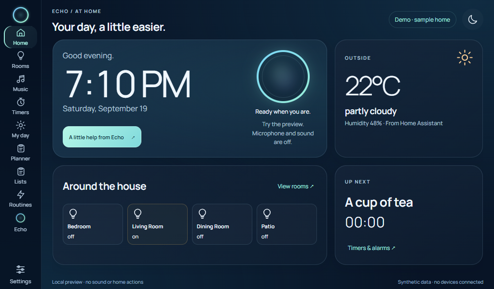

*Screenshots show the working software with synthetic data. The prototype photos
below show the actual round build. [Image sources and provenance](docs/images/README.md).*

## Two builds, one Echo

| Build | Hardware and experience | Start here |
| --- | --- | --- |
| **Round smart speaker** | Waveshare ESP32-S3-Touch-AMOLED-1.75, 466 × 466 touch display, onboard microphones, attached speaker, swipe navigation, and contextual physical buttons. Printable Crescent stand included. | [Board and firmware](docs/HARDWARE.md) · [Enclosure](#the-crescent-enclosure) |
| **Pi smart display** | Raspberry Pi 4B, touchscreen, and its own attached microphone and speaker. A larger view of conversation, rooms, music, calendars, and household tasks. Current display layout targets 1024 × 600. | [Pi bring-up and pairing](docs/SMART_DISPLAY.md#pi-hardware-and-bring-up) · [Pi voice](docs/PI_VOICE.md) |
| **Browser companion** | Open the workspace on a computer or phone. A paired browser can also use push-to-talk and room calls with microphone permission. Mobile background listening is not verified. | [Build options](docs/BUILD_OPTIONS.md) · [Private remote access](docs/TAILNET_ACCESS.md) |

The Pi **does not require the round speaker** for voice, music, or alarms. Choose
the input and output for each device explicitly. General support for other ESP32
boards and pairing a separate screen with a spare audio device remain future work.

## What Echo includes

| Experience | Current software |
| --- | --- |
| **Talk or type** | “Hey Echo” / “Okay Echo,” a warm activation cue, push-to-talk, visible listening/thinking/replying states, software mute, and request cancellation. |
| **Ask, research, remember** | A configured model or Hermes agent, supported web lookup with citations, longer research tasks, and explicitly saved facts you can review, edit, export, or delete. |
| **Control your home** | Home Assistant room lights, individual brightness/colour controls, thermostat modes and temperatures, speaker selection, and saved routines with device permissions. |
| **Play music** | Spotify Connect with artwork, track details, seeking, shuffle/repeat, and volume controls; HTTPS radio presets and supported local media on the display. |
| **Plan the day** | A daily briefing, selected calendars, timed/all-day event creation, shopping lists, tasks, and notes. |
| **Keep track of time** | Multiple timers, recurring alarms and reminders, snooze/dismiss, quiet hours, time zones, and daylight-saving handling. |
| **See and share** | Selected camera views, silent doorbell cards, photo albums, household notifications, room announcements, and answered two-way intercom. |
| **Make it yours** | Provider/model selection, editable personality, local voice choices, device names, room assignments, display preferences, and a printable enclosure. |

Home Assistant, Spotify, and Hermes are optional integrations. Features that need
an account, a selected source, or an audio device report their availability. The
[build queue](docs/BUILD_QUEUE.md) separates software coverage from physical and
live-service acceptance.

## The smart display

Make the home screen your own: choose four tiles for time and Echo, weather,
rooms, music, timers, lists or the thermostat. Music sits at bottom right by
default, with live artwork and playback control. Swipe left or right between
pages, or jump straight to a page from the sidebar.

Adjustable idle dimming and sleep keep the display from staying bright all day.
Tap once to wake, or use an enabled wake word. Paired X11 Pi displays can also
turn off the HDMI signal while music and the microphone keep running. Optional
Home Assistant motion/occupancy sensors can wake a selected display; source
sharing and per-screen setup are covered in [Screen comfort](docs/SMART_DISPLAY.md#screen-comfort).

### A conversation with room to breathe

Echo's status panel and settings sit beside the conversation. Type a message,
press the microphone, or enable local wake words after configuring the Pi's
microphone and speaker. Replies return to the device that heard the request.
Tapping the chat field opens a compact keyboard with local English swipe typing
and word corrections; the talk button stays within reach. The same keyboard
works in lists, notes, calendar drafts, and display text settings, with field
navigation and a newline key for notes. Phones keep their native keyboard.
The blue-green ring changes with listening, thinking, speaking, and connection
state; Stop and mute remain accessible.

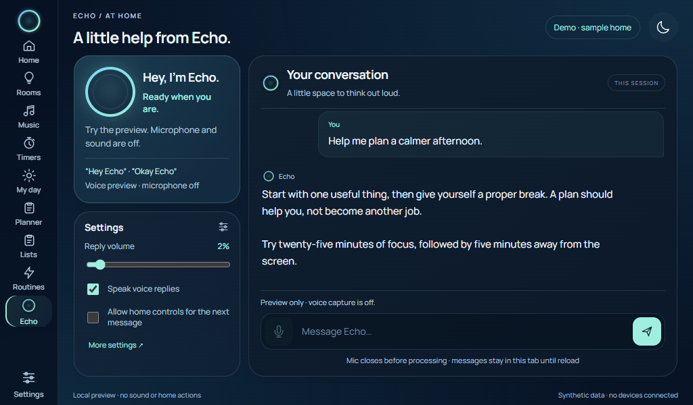

The display uses locally served Manrope, vector icons, a smooth ring with a soft
glow, and a dark blue palette. Its kiosk uses the active panel bounds without
unnecessary browser scaling. The [design guide](docs/DISPLAY_DESIGN.md) covers
native sizing, touch spacing, reduced motion, and remaining physical checks.

### Music and home control

Choose a room, adjust its lights, change a supported thermostat setting, or select
a Home Assistant speaker. Device grants and fresh state govern the available
controls. Google Home devices become controllable through their corresponding
Home Assistant integrations; Echo does not import Google Home's device graph.

<table>
<tr>
<td width="50%" valign="top"><strong>Your rooms</strong><br>Named lights, thermostat, and home-speaker controls.<br><a href="docs/images/display-rooms.png">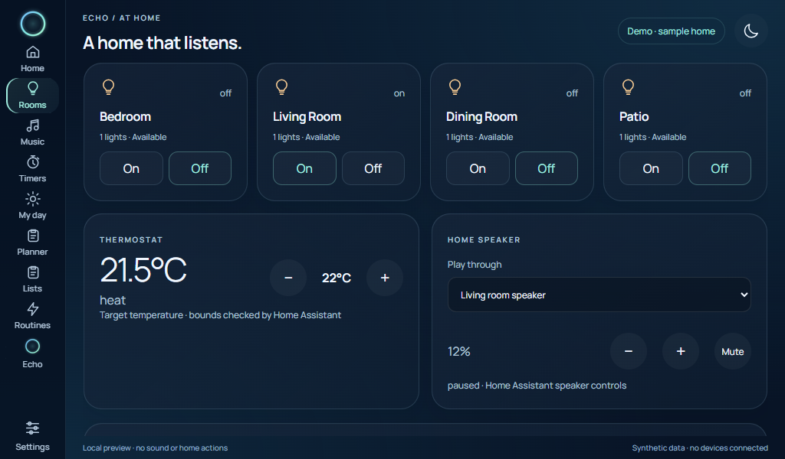</a></td>
<td width="50%" valign="top"><strong>Your music</strong><br>Artwork, track progress, transport, shuffle, repeat, and level.<br><a href="docs/images/display-music.png"></a></td>
</tr>
</table>

The Pi has a separately named **Spotify Connect receiver** that plays through its
selected output. The round speaker is another explicit destination. Spotify
Premium is required. **Connect with phone** shows a QR link to Spotify so you
can choose Echo from the phone's device picker; it is not an account-linking code.
Playlists, search, and queue browsing stay in Spotify. Chromecast, AirPlay, and
Bluetooth audio receivers are not included.

Pi wake words remain active during Spotify. Choose pause mode, or lower music by
80% through the cue and conversation with a shared audio output. Ducking restores
the previous level afterward; pause mode waits for you to resume. Interrupting
Echo's own spoken reply requires an echo-cancelled input. An optional
[Pi WebRTC audio service](docs/PI_ECHO_AUDIO.md) supplies that processing; room
pickup and feedback still need physical verification. See [display music](docs/MUSIC_DISPLAY.md), [Pi receiver
setup](docs/PI_SPOTIFY.md), and [voice setup](docs/PI_VOICE.md).

### Your day, lists, and reminders

**My day** combines weather, upcoming calendar events, reminders, tasks, and
shopping-list counts into a local briefing. Ask for the same briefing by voice or
text. **Planner** adds recurring alarms and reminders, quiet hours, snooze, and a
notification inbox. **Lists** keeps shopping, to-dos, and notes editable across
paired displays, with encrypted host storage.

<table>
<tr>
<td width="50%" valign="top"><strong>The day ahead</strong><br>Briefing and selected calendar sources.<br><a href="docs/images/display-daily.png">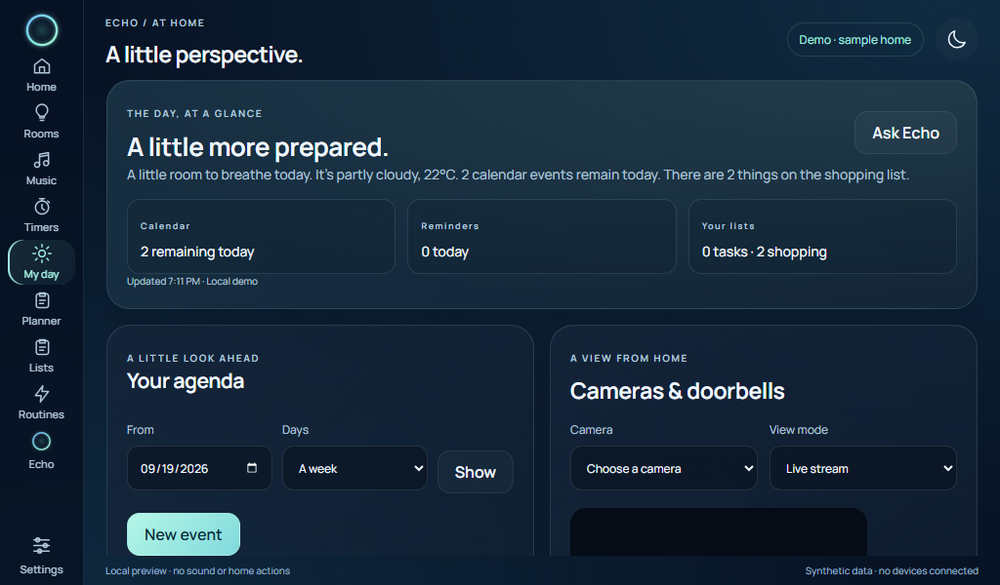</a></td>
<td width="50%" valign="top"><strong>A little structure</strong><br>Recurring reminders and household notifications.<br><a href="docs/images/display-planner.png">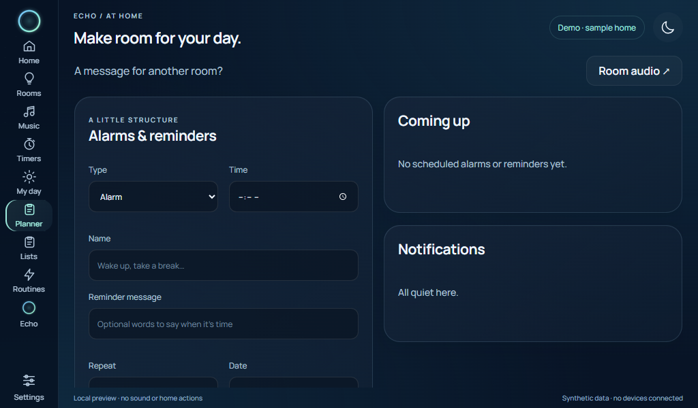</a></td>
</tr>
</table>

Calendars connect through Home Assistant. The owner selects which calendars to
share and separately permits event creation. The touch form supports timed and
all-day events. Describe an event by voice or text on the smart display, review
the model's editable draft, and choose **Create event** to save it. Calendar editing
and invitations are not implemented. [Daily briefing and calendar guide](docs/DAILY_BRIEFING.md).

### Cameras, doorbells, and room audio

Show a selected Home Assistant camera as a live MJPEG view or refreshing
snapshots. Doorbell presses create silent cards with a **View camera** action.
Camera audio, recording, and two-way doorbell talk are not included.

Send a short announcement to selected rooms and check its delivery result, or
call another paired endpoint. Intercom requires the other person to **Answer**
before sending microphone audio. Calls and announcements are opt-in; quiet hours,
mute, cancellation, and connection loss are handled explicitly.

<table>
<tr>
<td width="50%" valign="top"><strong>A view of home</strong><br>Selected camera and agenda, using generated sample frames.<br><a href="docs/images/display-camera-live.png">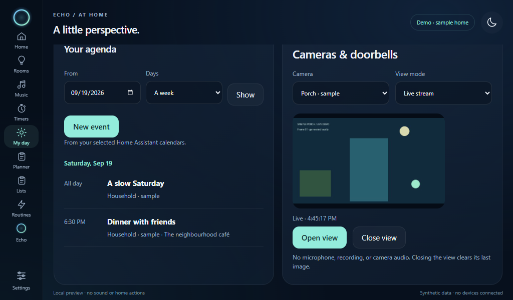</a></td>
<td width="50%" valign="top"><strong>Room to room</strong><br>An answered call with local mute and hang-up.<br><a href="docs/images/display-intercom.png">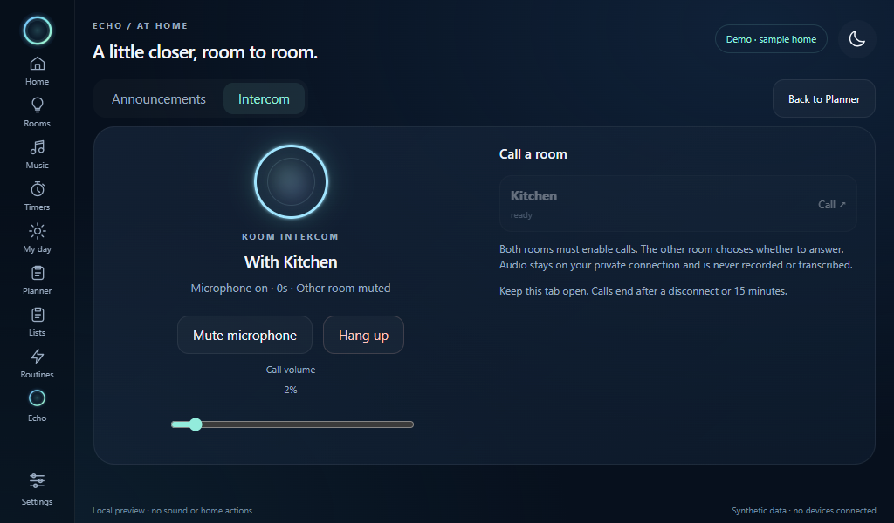</a></td>
</tr>
</table>

See [cameras and doorbells](docs/CAMERAS_AND_DOORBELLS.md),
[room audio](docs/ROOM_AUDIO.md), and [round intercom](docs/ROUND_INTERCOM.md).
Camera/calendar acceptance needs configured integrations; Pi and round intercom
still need physical listening and feedback checks.

<details>
<summary><strong>The quiet screen: clock and photos</strong></summary>

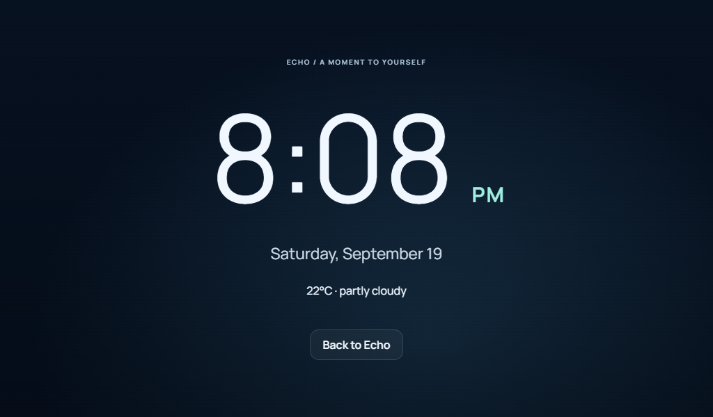

Choose a 12/24-hour clock, idle timeout, and software dimming, or use photos.
Session-only photos stay in that browser. Shared albums are stored encrypted on
the host; uploaded images are resized and stripped of metadata. Software dimming
does not turn off an LCD backlight.

</details>

## The web workspace

The companion web app is where you manage Echo as well as talk to it. Review a
conversation and its sources, organize explicit memories, run research tasks,
assign home devices to rooms, and configure the assistant without reflashing a board.

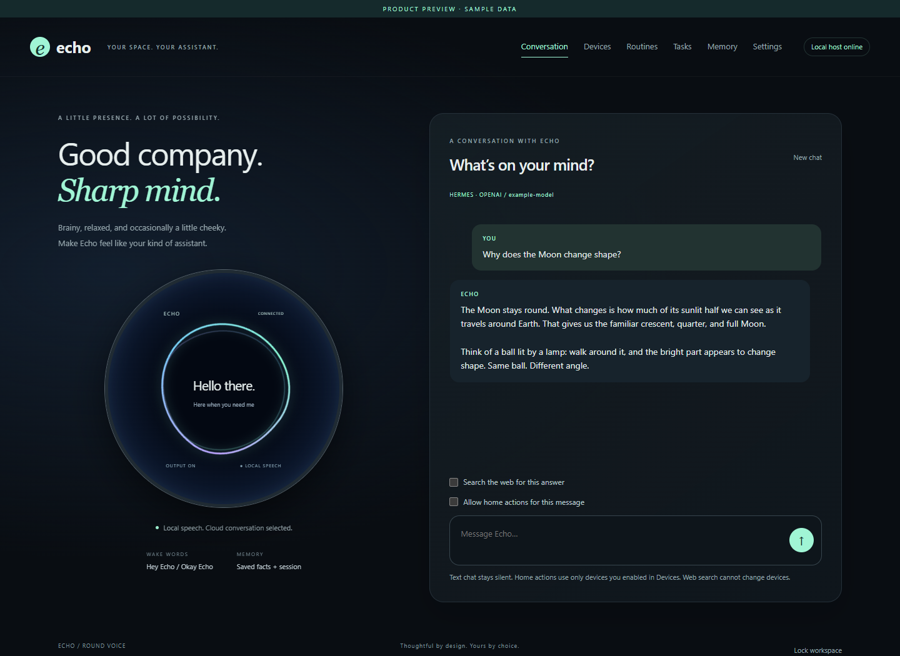

Select **OpenAI, Azure OpenAI / Foundry, Claude / Anthropic, or a compatible local
endpoint**, using either the direct conversation adapter or optional **Hermes**.
Edit the personality and response preferences in Settings. Tool and web-search
availability depends on the selected provider or configured Hermes tools; the
direct web-lookup path currently supports OpenAI and Azure.

<table>
<tr>
<td width="50%" valign="top"><strong>Choose the brain</strong><br>Provider, model, and agent settings.<br><a href="docs/images/web-models-detail.png">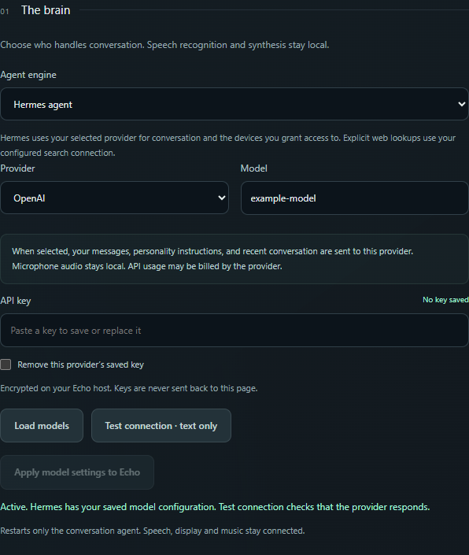</a></td>
<td width="50%" valign="top"><strong>Keep useful context</strong><br>Explicit saved facts with review and delete controls.<br><a href="docs/images/web-memory-detail.png">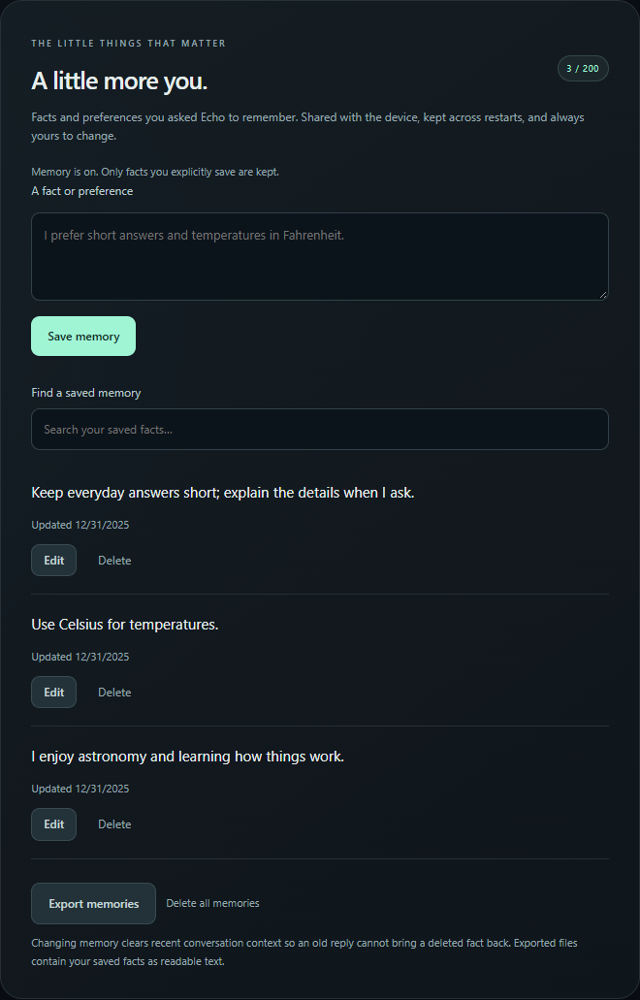</a></td>
</tr>
</table>

Local speech options include **Vosk or faster-whisper** for transcription and
**Pocket TTS, Kokoro, or Windows voices** for replies, depending on the host.
Model downloads are explicit. The optional Docker-hosted Hermes instance has both
an alternate WebUI and its native dashboard, connected to the same agent gateway.

<details>
<summary><strong>Devices, personality, routines, and research</strong></summary>

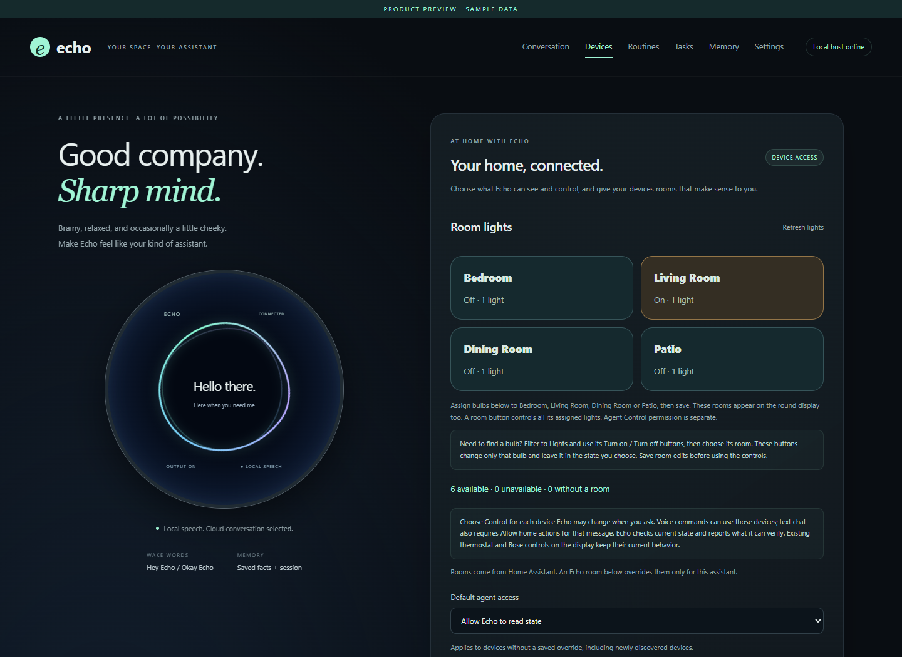

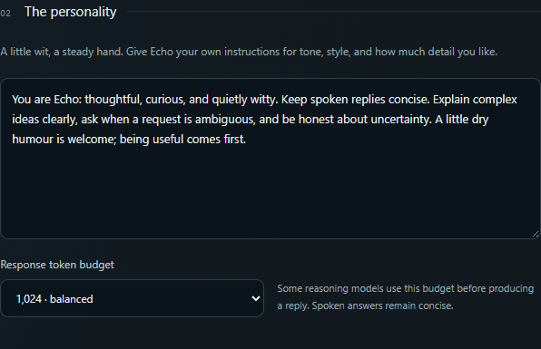

<table>
<tr>
<td width="50%" valign="top"><strong>Everyday routines</strong><br>Review a saved sequence before running it.<br><a href="docs/images/web-routines-detail.png">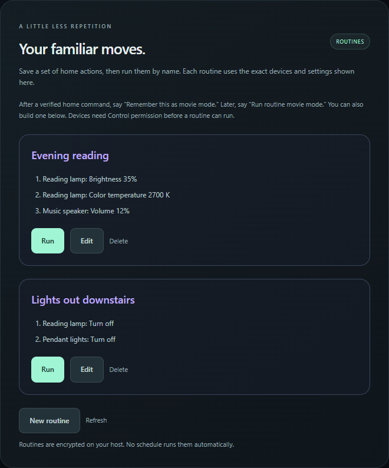</a></td>
<td width="50%" valign="top"><strong>Research with sources</strong><br>Task progress, reports, and links to follow.<br><a href="docs/images/web-tasks-detail.png">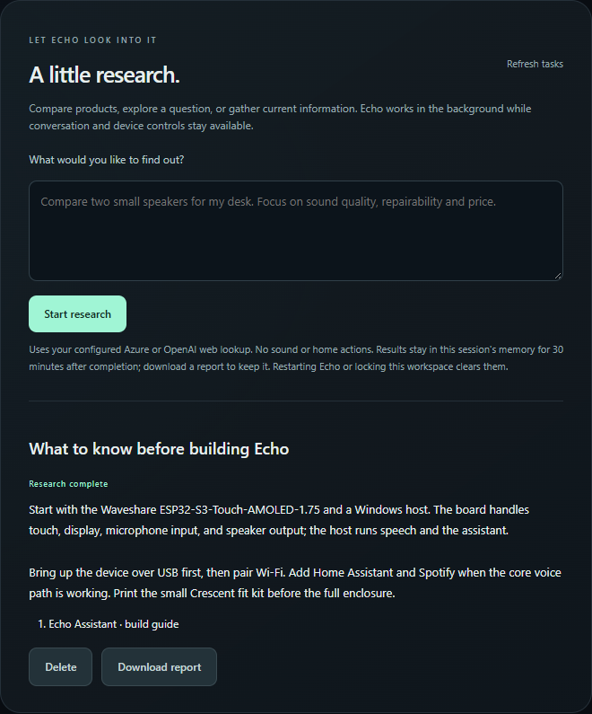</a></td>
</tr>
</table>

[Browse the web UI gallery](docs/WEB_UI.md) for the remaining pages and preview workflow.

</details>

## The round smart speaker

The original build combines a **466 × 466 AMOLED**, microphones, an attached
speaker, and a host connection over USB or paired Wi-Fi. Swipe between Echo,
weather, timers, lights, music, and settings. On the speaker page, the physical
buttons adjust volume; on the thermostat page, they adjust temperature. On
Home/Echo, the upper button toggles software microphone mute.

<table>
<tr>
<td width="50%" valign="top"><a href="docs/images/prototype-front.jpg">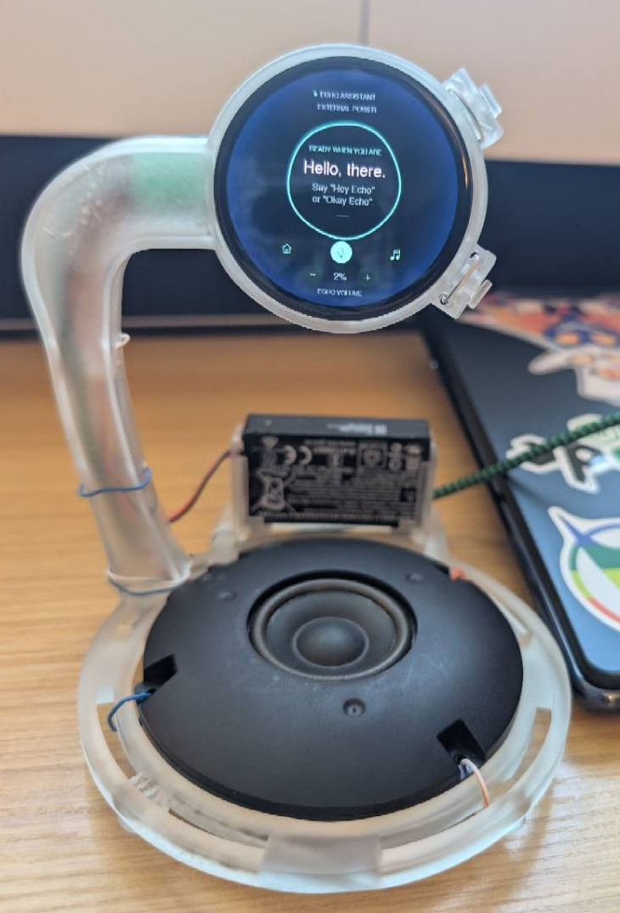</a><br><strong>Echo on the desk</strong><br>The powered prototype in its Crescent stand.</td>
<td width="50%" valign="top"><a href="docs/images/prototype-wiring-rear.jpg">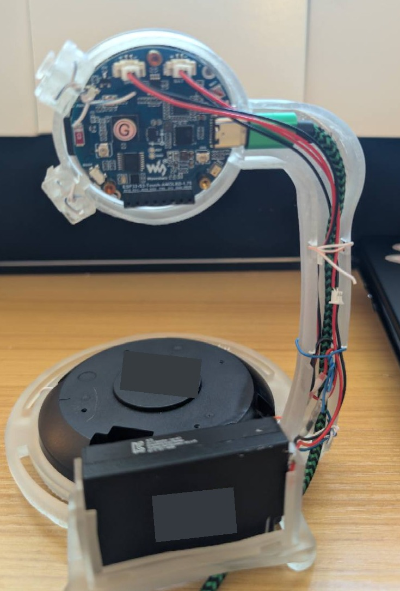</a><br><strong>Inside the build</strong><br>Accessible board, wiring, and adjustable mounts.</td>
</tr>
</table>

These are photographs of the assembled prototype, including temporary cable
restraints. The screen galleries below use the firmware's shared renderer with
sample data. The newer intercom firmware is built but still awaits installation
and physical acceptance.

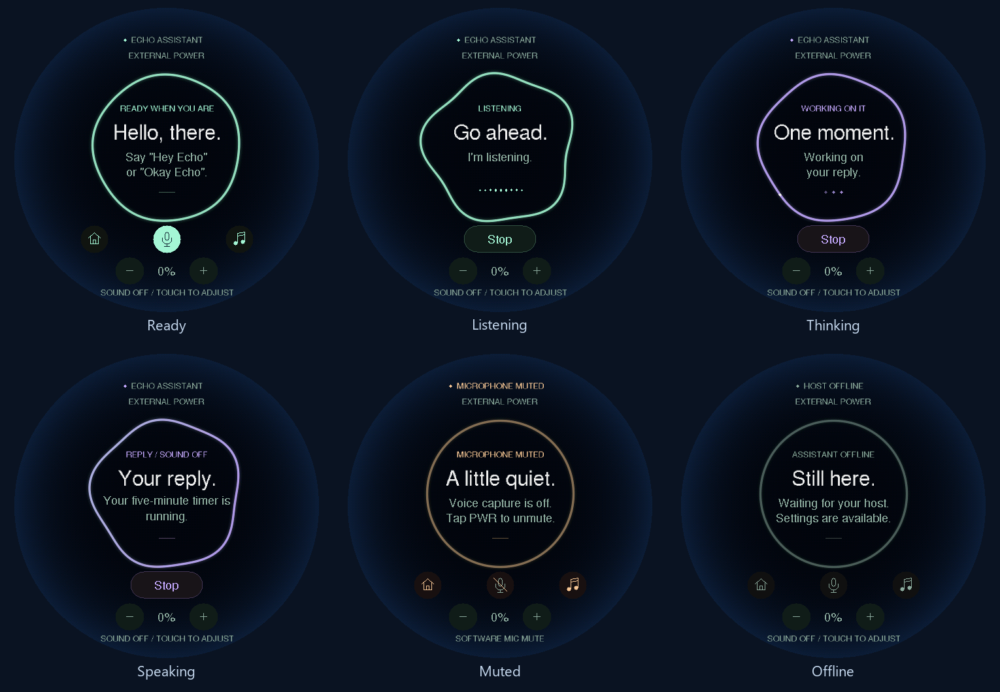

<details>
<summary><strong>Room controls, music, weather, timers, and battery screens</strong></summary>

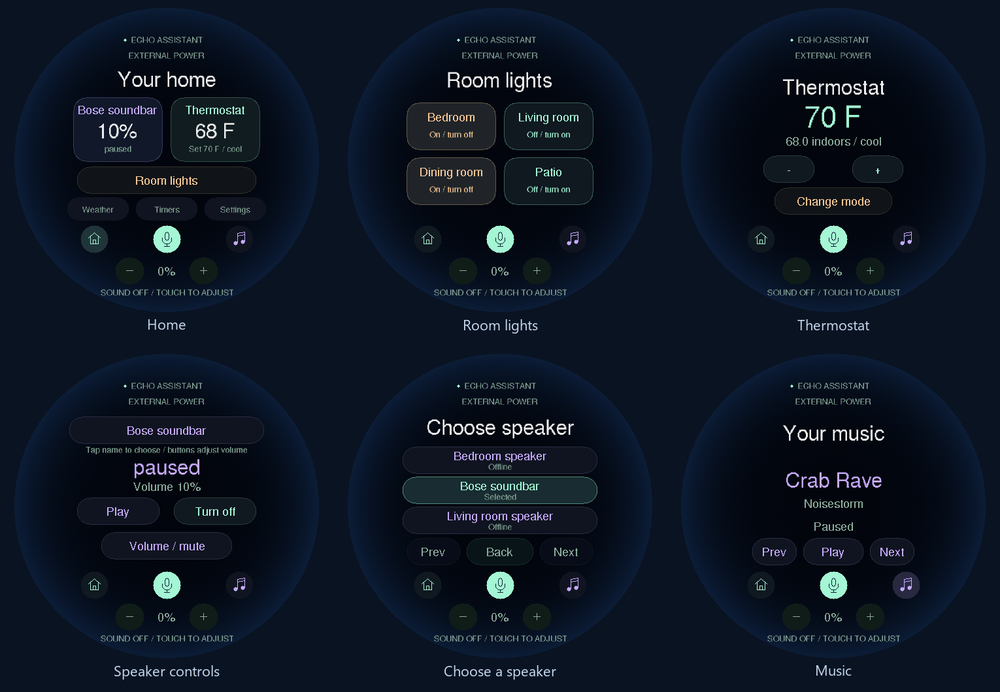

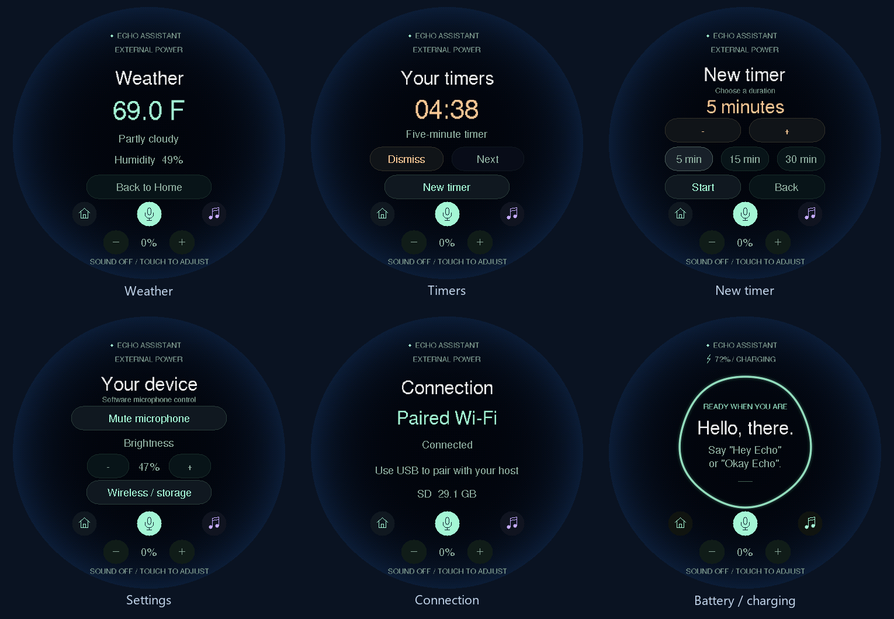

Battery charging in this gallery is simulated. Battery runtime and charging still
need physical validation with a compatible attached battery.

</details>

## How it fits together

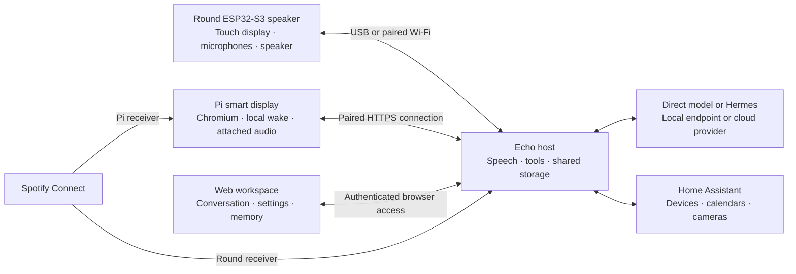
```mermaid
flowchart LR
    Round["Round ESP32-S3 speaker<br/>Touch display · microphones · speaker"]
    Pi["Pi smart display<br/>Chromium · local wake · attached audio"]
    Web["Web workspace<br/>Conversation · settings · memory"]
    Host["Echo host<br/>Speech · tools · shared storage"]
    Brain["Direct model or Hermes<br/>Local endpoint or cloud provider"]
    HA["Home Assistant<br/>Devices · calendars · cameras"]
    Spotify["Spotify Connect"]
    Round <-->|"USB or paired Wi-Fi"| Host
    Pi <-->|"Paired HTTPS connection"| Host
    Web <-->|"Authenticated browser access"| Host
    Host <--> Brain
    Host <--> HA
    Spotify -->|"Pi receiver"| Pi
    Spotify -->|"Round receiver"| Host
```

The host handles transcription, speech synthesis, conversations, tools, and shared
storage. The Pi handles its kiosk, local wake detector, capture/playback, and
Spotify receiver; the round firmware handles its own interface and audio transport.
The host can run on a Windows computer or in the documented Linux/x86-64 Docker
stack. Managed remote provisioning currently targets **Windows with Docker
Desktop and OpenSSH**; native-Linux provisioning is not packaged as a one-command install.

### Privacy and access

A Pi receives its own revocable pairing credential. Its local bridge keeps that
credential out of the browser and limits access to display features. Owner-only
settings include provider keys, source selection, and display administration.
Optional Tailscale access can be restricted to explicitly selected devices.

Saved facts, credentials, lists, schedules, and shared photos use encrypted host
storage. Explicit memory is separate from temporary conversation context. Local
speech runs on your hardware; a cloud conversation provider receives the text and
context needed for the request. Web lookup, Spotify, and configured integrations
use their respective services. Software mute closes Echo's capture path; it does
not electrically disconnect the microphone.

## Try the UI

The read-only web preview needs Python 3 and uses the standard library. From a
checkout you can browse the actual UI without a board, account, model, or home connection:

```powershell
git clone https://github.com/NotADevIAmaMeatPopsicle/Echo-Assistant.git
cd Echo-Assistant
py -3 tools/preview_web.py
```

Open **[http://127.0.0.1:8778/](http://127.0.0.1:8778/)**. Repository access is
required while the project is private. Press **Ctrl+C** to stop the preview.

<details>
<summary><strong>Try the interactive smart-display preview</strong></summary>

The larger preview uses the host's pinned Python dependencies, but needs no model
downloads. On Windows, from the checkout:

```powershell
py -3.13 -m venv .venv
./.venv/Scripts/python.exe -m pip install -r backend/requirements-windows.lock.txt
./.venv/Scripts/python.exe tools/preview_smart_display.py
```

Open **[http://127.0.0.1:8788/display](http://127.0.0.1:8788/display)**. Timers,
lists, forms, and simulated controls use in-memory sample data; closing the server
clears it. No real devices, microphone, speaker, or accounts are connected.

</details>

## Build your own

Choose an endpoint, prepare the host, and get it working on the desk before adding
an enclosure or battery. The [build-options guide](docs/BUILD_OPTIONS.md) explains
the supported configurations and future adapter ideas.

### Parts and tools

| Part | Round speaker | Pi smart display |
| --- | --- | --- |
| **Core board** | Waveshare ESP32-S3-Touch-AMOLED-1.75; 16 MB flash and 8 MB PSRAM. This is the exact supported ESP32 target. | Raspberry Pi 4B, preferably 4 GB RAM or more, with a 64-bit Linux OS and Chromium. |
| **Display** | Integrated 1.75-inch touch AMOLED. | Supported touchscreen; current layout targets 1024 × 600 landscape. Confirm its model and touch connection. |
| **Microphone and speaker** | Onboard microphone hardware and a speaker matching the board's electrical/connector requirements. | Attached USB microphone/audio interface and a selected speaker output. The Pi has no built-in microphone. Playback wake needs echo cancellation. |
| **Power and storage** | USB-C data cable; optional compatible battery and microSD. | Reliable 5.1 V / 3 A Pi supply, panel supply when required, cooling, and preferably a 32 GB or larger microSD. |
| **Host and tools** | Windows host, 64-bit Python 3.13, Git, and PlatformIO. | Shared Windows host with Python 3.13 and Git; PlatformIO is unnecessary for a Pi-only build. |
| **Network** | USB first; optional paired 2.4 GHz Wi-Fi. | Wi-Fi or Ethernet with access to the Echo host. |

The [Docker guide](docs/DEPLOYMENT.md) covers advanced hosting. Home Assistant and
Spotify Premium are optional; set them up after the basic device works.

### 1. Prepare the host

From the repository directory in PowerShell:

```powershell
py -3.13 -m venv .venv
./tools/setup.ps1
```

Reuse an existing `.venv` if you already prepared the preview. Setup installs the
pinned host dependencies and verifies a Vosk model download. See
[local setup](docs/SETUP.md) for neural voices and optional echo cancellation.

### 2. Set up the endpoint

**Round speaker:** follow [hardware and firmware setup](docs/HARDWARE.md) to
identify the board, preserve its original full-flash backup, build, and flash.
Set `ECHO_DEVICE_MAC` locally to the verified identity; the repository supplies
no paired device identity. Add Wi-Fi through the [USB pairing flow](docs/WIRELESS.md).

**Pi display:** preserve and verify the original SD-card backup, then follow
[Pi bring-up](docs/SMART_DISPLAY.md#pi-hardware-and-bring-up). Start the host in the
next step before pairing. The installer adds a versioned client and loopback bridge
to a supported desktop; it does not require reflashing the card. Select the Pi's
own input/output in [voice setup](docs/PI_VOICE.md), then configure
[Spotify](docs/PI_SPOTIFY.md) and [alerts](docs/PI_ALERTS.md) if wanted.

### 3. Start Echo and open its workspace

For a **Pi-only local host**:

```powershell
./tools/run.ps1 start -DisplayOnly
./.venv/Scripts/python.exe tools/open_ui.py --display
```

For the **round speaker**:

```powershell
./tools/run.ps1 start
./.venv/Scripts/python.exe tools/open_ui.py
```

The launcher opens an authenticated session; the local host defaults to
`http://127.0.0.1:8768/`. In Settings choose the provider, model, voice, and
personality. The conversation provider can stay disabled while you configure
timers, lists, and home integrations. Pair a Pi from **Display → Settings → Your
displays**, then complete its client installation. Start audible tests at **2%**.

### 4. Connect the services you want

| Add | Guide |
| --- | --- |
| Lights, climate, speakers, and routines | [Home Assistant and permissions](docs/HOME_CONTROL.md) |
| Music from the Spotify app | [Round receiver](docs/MUSIC.md) · [Pi receiver](docs/PI_SPOTIFY.md) |
| Calendar agenda and event creation | [Daily briefing and calendars](docs/DAILY_BRIEFING.md) |
| Camera views and doorbell cards | [Cameras and doorbells](docs/CAMERAS_AND_DOORBELLS.md) |
| Announcements and answered calls | [Room audio](docs/ROOM_AUDIO.md) · [Round intercom](docs/ROUND_INTERCOM.md) |
| An always-on host and Hermes | [Docker deployment and UIs](docs/DEPLOYMENT.md) |
| Access from selected phones/computers | [Private Tailscale access](docs/TAILNET_ACCESS.md) |

## The Crescent enclosure

Crescent is the printable stand for the **round speaker build**. A removable snap
ring holds the display above adjustable speaker posts. Guided button plungers
keep both physical controls accessible, and a rear channel routes wiring past
the battery cradle.

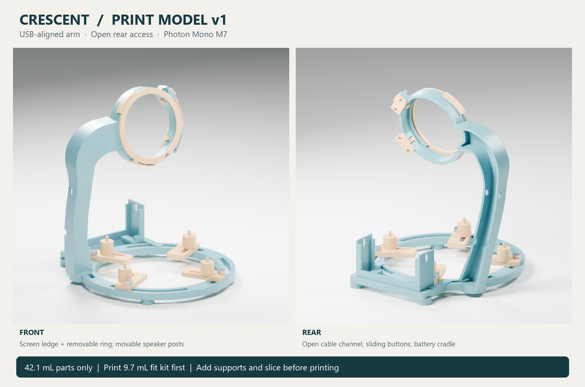

**[STL models](enclosure/crescent-v1/STL)** ·
**[Print and assembly walkthrough](enclosure/crescent-v1/PRINT_AND_ASSEMBLY.md)** ·
**[Editable geometry](enclosure/crescent-v1/source)**

The package includes **12 STL designs**, optional posts/spacers, display fit gauges,
editable Python geometry, and suggested Photon Mono M7 print orientations.

1. Print the display fit kit and check cured dimensions against the actual board.
2. Check USB clearance, free button travel, and gentle snap-ring engagement.
3. Print the stand and selected speaker/battery mounts.
4. Assemble with the documented M2/M3 fasteners and support the cables without
   loading the connectors.

The demonstrated build uses a salvaged Google Home Mini speaker in its acoustic
housing. The battery holder's dimensions do not establish electrical compatibility.
The assembly guide includes quantities, print volumes, and close-up photographs.
Repeatable fit, durability, thermal behavior, and acoustic performance still need
broader physical validation. A matching Pi enclosure is not included.

## Current status

**Private alpha; the complete two-build package has not been released.** Older
release assets predate the Pi expansion and new room-audio work. The current
checkout and [build queue](docs/BUILD_QUEUE.md) describe this development state;
[release history](docs/RELEASE.md) identifies the earlier source package.

| Area | Evidence and remaining work |
| --- | --- |
| **Round speaker** | Physical prototype, existing voice/music path, and touch navigation exercised. New intercom and OLED screen-protection firmware compiled; installation and physical checks remain. Sustained playback, distant wake, battery operation, and repeatable enclosure fit need broader acceptance. |
| **Pi display** | Installed and running at 1024 × 600. Pairing, OS restart, live revocation/re-enrollment, and recovery after a 90-second Echo connection outage verified. Exact panel identification, complete touch calibration, cold power-on, and Wi-Fi/router restart checks remain. |
| **Pi audio and room calls** | Native wake, push-to-talk, reply routing, Spotify, alarms, announcements, and intercom implemented. Provisional USB-headset Spotify playback is owner-confirmed; wake/cue/reply audibility, feedback, interruption, and final microphone/speaker assembly remain open. |
| **Home and daily tools** | Controls, lists, reminders, briefing, calendar forms, camera relay, and doorbell UI implemented. Live calendar writes and camera/doorbell behavior need configured integrations and acceptance. |
| **Packaging** | Host tests, firmware build, fresh Docker/API startup, isolated encrypted-archive restore, Linux Pi checks, browser flows, and privacy guards exercised. Broader fresh-install/provider coverage and a full Windows/Hermes disaster restore remain open. |

Further work includes generic audio-endpoint adapters, synchronized grouped playback,
calendar editing/invitations, household profiles, and external calling. Proprietary
casting and commercial streaming-video services are not implemented. The project
does not claim complete Nest Hub or Echo Show feature parity.

## Documentation

| Guide | What it covers |
| --- | --- |
| [Setup](docs/SETUP.md) · [Build options](docs/BUILD_OPTIONS.md) | Host preparation, startup, speech, and device choices |
| [Smart display](docs/SMART_DISPLAY.md) · [Display design](docs/DISPLAY_DESIGN.md) | Pi installation, pairing, page map, typography, and native sizing |
| [Pi voice](docs/PI_VOICE.md) · [Spotify](docs/PI_SPOTIFY.md) · [Alerts](docs/PI_ALERTS.md) | Independent Pi microphone and speaker paths |
| [Hardware](docs/HARDWARE.md) · [Wireless](docs/WIRELESS.md) | Round-board identity, original backup, build, flash, and pairing |
| [Home control](docs/HOME_CONTROL.md) · [Calendars](docs/DAILY_BRIEFING.md) · [Cameras](docs/CAMERAS_AND_DOORBELLS.md) | Sources, permissions, actions, and integration limits |
| [Music](docs/MUSIC_DISPLAY.md) · [Room audio](docs/ROOM_AUDIO.md) · [Round intercom](docs/ROUND_INTERCOM.md) | Playback, destinations, announcements, and calls |
| [Deployment](docs/DEPLOYMENT.md) · [Private access](docs/TAILNET_ACCESS.md) | Docker, Hermes UIs, storage, recovery, and selected-device access |
| [Crescent assembly](enclosure/crescent-v1/PRINT_AND_ASSEMBLY.md) · [Web gallery](docs/WEB_UI.md) | Printable parts, build photographs, and UI examples |
| [Build queue](docs/BUILD_QUEUE.md) · [Release history](docs/RELEASE.md) · [Package checks](docs/PACKAGE_CHECKS.md) | Current acceptance, historical releases, and reproducible checks |

<details>
<summary><strong>Source layout and contributing</strong></summary>

| Directory | Purpose |
| --- | --- |
| `src`, `include` | ESP32 firmware and shared scene renderer |
| `backend`, `web` | Host services, web workspace, and smart-display UI |
| `deploy/pi` | Pi kiosk, pairing, local wake, Spotify, and alerts |
| `deploy/host`, `deploy/remote` | Docker images, Compose, and hosting helpers |
| `tools`, `config` | Setup, previews, diagnostics, examples, and pinned dependencies |
| `tests` | Offline checks using synthetic services |
| `enclosure/crescent-v1` | Printable parts, source, renders, and assembly guide |
| `lib`, `third_party` | Vendored components and attribution |

See [Contributing](CONTRIBUTING.md) for development checks. Use synthetic preview
data for documentation screenshots, and keep credentials, personal configuration,
recordings, model weights, paired firmware, and backups out of Git. Report security
issues through [Security](SECURITY.md).

</details>

## License and acknowledgements

Echo Assistant is **GPL-3.0-or-later**. Software dependencies, fonts, models, and
services retain their own terms; see [LICENSE](LICENSE) and
[third-party notices](THIRD_PARTY_NOTICES.md). Model weights and pre-paired firmware
are not included. This is an independent project, unaffiliated with Waveshare,
Home Assistant, Spotify, Google, Nous Research, Anycubic, or model providers.
