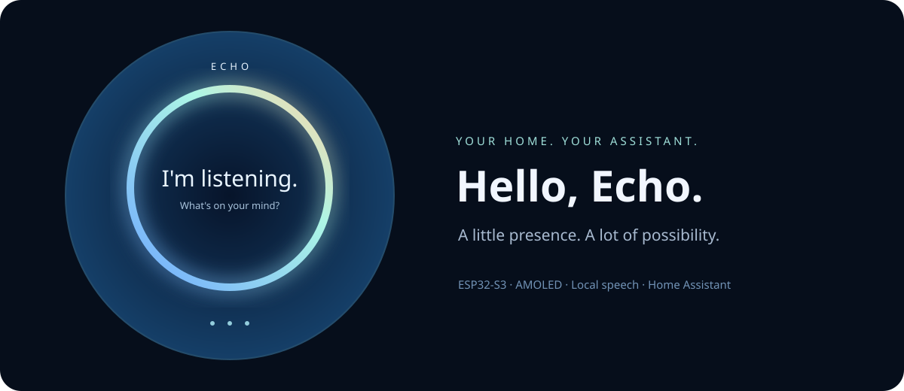

# Echo Assistant

<p align="center"></p>

[](https://github.com/NotADevIAmaMeatPopsicle/Echo-Assistant/actions/workflows/ci.yml)


A personal voice assistant with a round AMOLED display, local speech processing,
Home Assistant controls, Spotify Connect and an optional Hermes agent.
Echo aims to be useful, calm and a little witty. You choose its conversation
provider, personality, voice and permitted devices.

**Alpha source release.** The firmware and host have been exercised on hardware;
this public distribution introduces portable configuration and is still being
validated across fresh installations. See [release status](docs/RELEASE.md).

## What it does

- Responds to **Hey Echo** and **Okay Echo**, with a synthesized warm activation cue.
- Shows listening, thinking, speaking, muted, offline and playback states on a
  466 × 466 display, with a blue background and softly glowing ring.
- Provides touch/swipe pages for speakers, thermostat, room lights, weather,
  timers, music and settings. Physical buttons control the current page.
- Runs speech recognition and synthesis on your host. Supports Vosk, optional
  faster-whisper, Pocket TTS, Kokoro and Windows SAPI where supported.
- Uses a configurable direct model connection or **Hermes** with Azure, OpenAI,
  Anthropic or a compatible local endpoint. API keys are encrypted at rest.
- Integrates Home Assistant through tools with per-device Read / Control / Hidden
  permissions, request-scoped actions and result checks.
- Receives Spotify Connect audio through librespot. **Spotify Premium is required.**
- Offers explicit encrypted memory, named routines, background research with
  sources, cancellation, settings and a web UI.
- Connects the board over USB or paired Wi-Fi with TLS-PSK. Reads battery/charging
  status when a compatible battery is present.

The ESP32 handles the display, controls and audio transport. **A separate host is
required** for speech, the agent and integrations. Cloud conversation and Spotify
use their respective services; local speech does not imply that every configured
integration is offline.

## Supported hardware

**Waveshare ESP32-S3-Touch-AMOLED-1.75**: ESP32-S3, 16 MB flash, 8 MB PSRAM,
CO5300 AMOLED, CST9217 touch, ES7210 microphones, ES8311 audio and AXP2101 power
management. This is board-specific firmware, not a universal ESP32 image.

See [hardware and flashing](docs/HARDWARE.md) before connecting or flashing.
Software microphone mute stops streaming; it does not electrically disconnect
the microphones. Begin speaker tests at low volume.

## Start here

1. Follow [local setup](docs/SETUP.md) for a Windows host and first connection.
2. Build and back up the board before following [firmware setup](docs/HARDWARE.md).
3. Pair [Wi-Fi](docs/WIRELESS.md), then configure providers and speech in Settings.
4. Connect [Home Assistant](docs/HOME_CONTROL.md) and optionally
   [Spotify](docs/MUSIC.md).
5. For an always-on host, follow the [Docker deployment guide](docs/DEPLOYMENT.md).

```powershell
py -3.13 -m venv .venv
./tools/setup.ps1
./tools/run.ps1 start
./.venv/Scripts/python.exe tools/open_ui.py
```

Setup downloads pinned dependencies and a speech model into ignored local
directories. Starting the host does not install firmware or configure home devices.
The initial local web UI is `http://127.0.0.1:8768/`; the launcher creates a
single-use sign-in link. See the deployment guide for remote UI tunnels.

## Repository map

| Directory | Purpose |
| --- | --- |
| `src`, `include` | Board firmware and scene renderer |
| `backend`, `web` | Host services and web application |
| `deploy/host`, `deploy/remote` | Docker images, Compose and managed host helpers |
| `tools` | Setup, model preparation, pairing, backups and explicit diagnostics |
| `config` | Nonsecret examples and dependency/model pins |
| `tests` | Offline host tests with synthetic data |
| `lib`, `third_party` | Vendored dependencies, attribution and licenses |

Private state belongs in ignored `local/`, `.env` files and `backups/`. Never add
keys, Wi-Fi credentials, full flash backups, device identities or session data
to a public issue or commit. [Contributing](CONTRIBUTING.md) describes the release
checks; [security](SECURITY.md) describes responsible reports.

## License and acknowledgements

The source distribution is **GPL-3.0-or-later**. Third-party components retain their
own terms, including the bundled GNU FreeFont glyphs. See [LICENSE](LICENSE) and
[third-party notices](THIRD_PARTY_NOTICES.md). Model weights, dependencies and
vendor services have separate terms; no weights or authenticated binaries are
included in this repository. This is an independent project, unaffiliated with
Waveshare, Home Assistant, Spotify, Google, Nous Research or model providers.
