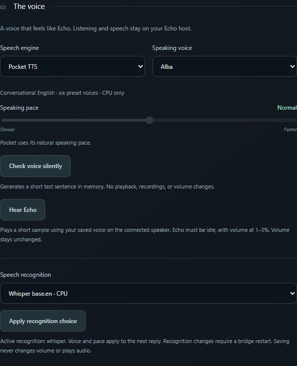
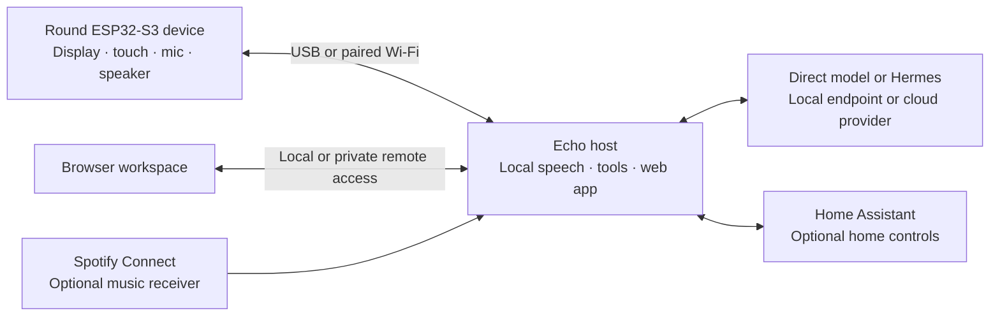
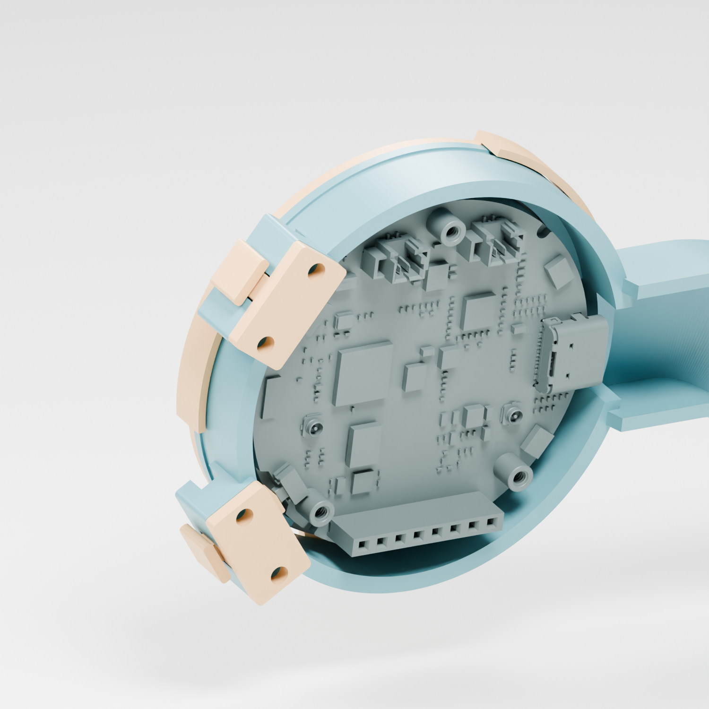
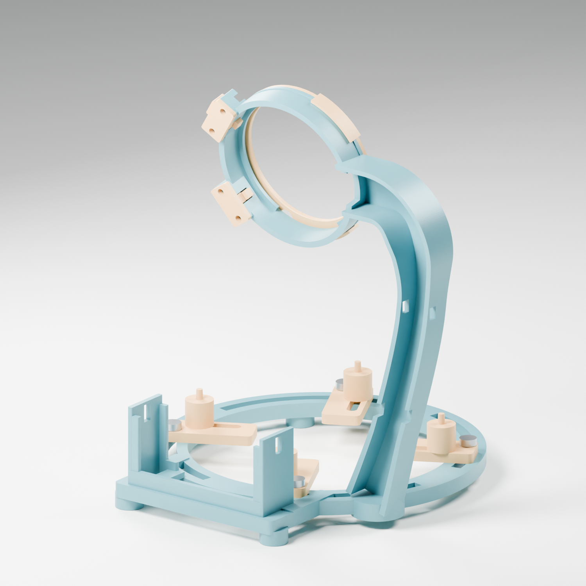

# Echo Assistant

### An open-source smart speaker you can build, understand, and make your own.

Echo brings an AI voice assistant, music, and home control to a round AMOLED touchscreen.
Say **“Hey Echo”** or **“Okay Echo”**, hear a warm activation cue, and watch the
screen respond as it listens, thinks, and replies. A companion web app puts
conversation, devices, memory, and customization in one place.

**In development:** a larger Raspberry Pi smart display now shares Echo's
backend. The repository is private while both builds are completed as one
package. See the [smart-display preview, feature map, and build plan](docs/SMART_DISPLAY.md)
for implemented pages and the remaining hardware and integration work.

[](https://github.com/NotADevIAmaMeatPopsicle/Echo-Assistant/actions/workflows/ci.yml)


[](LICENSE)

**[Prototype](#the-built-prototype)** · **[Web app](#the-web-workspace)** · **[Device screens](#on-the-device)** ·
**[Build your own](#build-your-own)** · **[Enclosure](#the-crescent-enclosure)** ·
**[Documentation](#documentation)**

## The built prototype

The Crescent stand, printed and assembled: a working round display above a
repurposed Google Home Mini speaker, with the board and cable route accessible
from the back. Click either photo for a closer look.

<table>
<tr>
<td width="50%" valign="top"><a href="docs/images/prototype-front.jpg"></a><br><strong>Echo on the desk</strong><br>The actual display running the ready screen.</td>
<td width="50%" valign="top"><a href="docs/images/prototype-wiring-rear.jpg"></a><br><strong>Inside the build</strong><br>Open access to the board, wiring and battery cradle.</td>
</tr>
</table>

These are photographs of the current prototype, including its temporary cable
restraints. The [assembly walkthrough](enclosure/crescent-v1/PRINT_AND_ASSEMBLY.md)
pairs close-ups with printable models and fitting instructions.

## What you can do with Echo

| Experience | What it includes |
| --- | --- |
| **Talk naturally** | Wake words, local speech recognition and synthesis, spoken replies, visible listening/thinking states, and a Stop control. |
| **Ask, explore, remember** | Conversation through a chosen model or Hermes, web lookup with sources, research tasks, and explicitly saved facts you can edit or delete. |
| **Control the room** | Home Assistant lights, thermostat, speakers, and named routines, with per-device permissions and action results. |
| **Play your music** | A Spotify Connect receiver, track controls, speaker selection, and voice interruption/resume. Spotify Premium is required. |
| **Use it at a glance** | Swipeable pages for weather, timers, lights, music, settings, connection, and battery status. |
| **Make it yours** | Provider and model selection, editable personality, local voice choices, an open firmware/host stack, and printable enclosure source. |

Echo is a **board-and-host system**: the ESP32 runs the display, touch controls,
and audio transport; a separate computer runs speech and the assistant. Start
with the Windows host over USB, then add Wi-Fi and integrations at your own pace.
Home Assistant, Spotify, and Hermes are optional additions to the basic setup.

## The web workspace

Talk to Echo quietly, organize its memory, connect devices, and shape its
personality from a browser. The workspace is available beside the device or
through [private access from selected Tailscale devices](docs/TAILNET_ACCESS.md).


*The working web interface, shown with sample data. Web screenshots come from
the included app; device galleries use its shared firmware renderer.*

### Conversation and home control

Ask a question, request an answer with web sources, or enable home actions for a
particular message. **Devices** brings room-light controls, device inventory,
room assignments, and Read / Control / Hidden permissions together. Echo checks
the permitted targets and reports what it can confirm.


Room requests resolve all the room's bulbs. Home Assistant is the device source;
existing Google Home devices need their corresponding HA integration before Echo
can control them.

### Personality, voice, and memory

Choose **OpenAI, Azure OpenAI / Foundry, Claude / Anthropic, or a compatible local
endpoint**. Use a direct model connection or the optional **Hermes agent**.
Give Echo your own tone and response preferences, then choose a local voice.
Saved facts appear in Memory, where you can review, edit, export, or delete them.

<table>
<tr>
<td width="50%" valign="top"><strong>Choose the brain</strong><br>Provider, model, and agent settings.<br><a href="docs/images/web-models-detail.png"></a></td>
<td width="50%" valign="top"><strong>Keep useful context</strong><br>Explicit memories with edit and delete controls.<br><a href="docs/images/web-memory-detail.png"></a></td>
</tr>
</table>


Local speech options include **Vosk or faster-whisper** for recognition and
**Pocket TTS, Kokoro, or Windows voices** for replies, depending on the host.
Speech stays on the host; conversation uses the provider you select.

<details>
<summary><strong>See the voice controls</strong></summary>



</details>

### Routines and research

Bundle familiar device settings into a named routine, review its steps, and run
it when wanted. For longer questions, start a research task and return to a
report with sources and a download button. Ongoing work has visible status and
cancellation controls where applicable.

<table>
<tr>
<td width="50%" valign="top"><strong>Everyday routines</strong><br>Named, inspectable actions for permitted devices.<br><a href="docs/images/web-routines-detail.png"></a></td>
<td width="50%" valign="top"><strong>Research with sources</strong><br>A task, its report, and links to follow further.<br><a href="docs/images/web-tasks-detail.png"></a></td>
</tr>
</table>

### Try the UI before buying hardware

The read-only preview uses Python's standard library and sample data. It loads
the actual web UI without keys, model downloads, a board, or a home connection:

```powershell
git clone https://github.com/NotADevIAmaMeatPopsicle/Echo-Assistant.git
cd Echo-Assistant
py -3 tools/preview_web.py
```

Open **[http://127.0.0.1:8778/](http://127.0.0.1:8778/)** and browse the pages.
Press **Ctrl+C** in the terminal when finished. Changes and device actions are
disabled in the preview. Follow the build steps below for a connected assistant.

## On the device

The **466 × 466 AMOLED** uses a deep blue background, a softly glowing ring,
and distinct colours and motion for each voice state. Listening, thinking,
replying, software mute, and an offline host each have a clear visual treatment.


Swipe between pages or use the touch navigation. Tap the speaker name to choose
a speaker; the physical buttons adjust its volume. On the thermostat page,
those buttons adjust temperature. On Home/Echo, the upper button toggles
software microphone mute.


<details>
<summary><strong>Weather, timers, settings, and connection screens</strong></summary>


The battery image is a simulated charging state. Battery operation and charging
still require physical acceptance with a compatible attached battery.

</details>

## How it fits together



The firmware handles the interface and streams audio to the host. Speech
recognition and synthesis run locally. The host coordinates conversations,
explicit memory, home tools, timers, and music. An always-on Docker deployment
can run `echo-api` and the optional `echo-agent` together; browsers open the
hosted UI.

Cloud conversation sends text and relevant context to the selected provider.
Web lookup and Spotify also use their services. A local conversation endpoint
is available for builds that keep the language model on their own hardware.

## Build your own

Start your smart speaker build with **the supported board, a speaker, a USB data cable,
and a Windows computer**. Get that working on the desk, then add the enclosure,
battery, and remote hosting as separate steps.

### Parts and tools

| Item | Needed for | Notes |
| --- | --- | --- |
| **Waveshare ESP32-S3-Touch-AMOLED-1.75** | Core build | Exact supported board: 16 MB flash, 8 MB PSRAM, touch AMOLED, ES7210 microphones, ES8311 audio, and AXP2101 power management. |
| **Compatible speaker and connector** | Spoken replies and music | Use the board's speaker output and the vendor's electrical specification. Check whether the purchased kit includes a speaker. |
| **USB-C data cable** | Power, backup/flash, and initial connection | Use a data-capable cable. |
| **Windows computer** | Speech and assistant host | 64-bit Python 3.13 is the recommended start. Local speech runs on CPU; local language-model requirements depend on the model. |
| **Git and PlatformIO** | Checkout and firmware build | Firmware is built from source. The hardware guide covers setup and backup. |
| **2.4 GHz Wi-Fi** | Optional wireless operation | Pair through USB first; the host must remain reachable. |
| **Home Assistant / Spotify Premium** | Optional home control / music | Configure these after the core device works. |
| **Printed parts and fasteners** | Optional enclosure | Models, fit gauges, and the complete hardware list are included below. |
| **Compatible battery / microSD card** | Optional hardware | USB power is sufficient for the first build. The Crescent holder establishes mechanical dimensions, not battery electrical compatibility. |

### 1. Prepare the host

Clone the repo if you have not already done so. From its directory in PowerShell:

```powershell
py -3.13 -m venv .venv
./tools/setup.ps1
```

This installs pinned host dependencies and a Vosk model into the project.
[Local setup](docs/SETUP.md) covers optional echo cancellation, neural voices,
and platform requirements. Speech model downloads are explicit.

### 2. Back up and flash the board

Connect by USB and follow **[hardware and firmware setup](docs/HARDWARE.md)**:
identify the board, preserve its full original-flash backup, build with
PlatformIO, and use the identity-checked flashing command.

Set `ECHO_DEVICE_MAC` to the board identity verified during setup. This value
belongs to your local build and is not supplied by the repository.

### 3. Start Echo and open its workspace

```powershell
./tools/run.ps1 start
./.venv/Scripts/python.exe tools/open_ui.py
```

The launcher opens the authenticated local UI at `http://127.0.0.1:8768/`.
In **Settings**, select a provider and model, add the corresponding key, choose
the voice, and edit the personality. The provider can stay disabled while you
bring up the built-in clock, timers, and configured home controls.

Start speaker checks at low volume. Software mute stops microphone streaming;
it does not electrically disconnect the microphones.

### 4. Add the features you want

| Next step | Guide |
| --- | --- |
| Give Echo its own Wi-Fi connection | [USB pairing and wireless operation](docs/WIRELESS.md) |
| Connect lights, thermostat, and speakers | [Home Assistant and device permissions](docs/HOME_CONTROL.md) |
| Select Echo from the Spotify app | [Spotify Connect setup](docs/MUSIC.md) |
| Use an always-on host; add Hermes | [Docker deployment and browser access](docs/DEPLOYMENT.md) |
| Open the UIs from selected devices | [Private Tailscale access](docs/TAILNET_ACCESS.md) |
| Assemble the screen and speaker stand | [Crescent print and assembly guide](enclosure/crescent-v1/PRINT_AND_ASSEMBLY.md) |

## The Crescent enclosure

An open desk stand brings the screen, speaker, and wiring together. The display
sits in a removable snap ring above adjustable speaker posts. Two guided button
plungers keep the controls accessible, while a rear channel routes the cables
past the battery cradle.


**[Get the models](enclosure/crescent-v1/STL)** ·
**[Assembly walkthrough](enclosure/crescent-v1/PRINT_AND_ASSEMBLY.md)** ·
**[Edit the geometry](enclosure/crescent-v1/source)**

The package includes **12 STL designs**, optional post sizes and spacers, a
display fit kit, clearance gauges, and suggested **Photon Mono M7** orientations.
Editable Python geometry and digital verification records accompany the meshes.

1. **Print the fit kit:** carrier `09` × 1, ring `02` × 1, plungers `03` × 2,
   and keepers `04` × 2. About **9.66 mL** of model volume before supports.
2. **Check the actual parts:** cured display fit, USB plug clearance, free
   button travel, and gentle ring engagement.
3. **Print the stand and mounts:** about **42.08 mL** for the standard complete
   assembly, excluding supports, optional pieces, and fit tests.
4. **Assemble with the guide:** M2/M3 screws and nuts secure the button keepers
   and adjustable mounts; soft restraints support the cables and battery.

<table>
<tr>
<td width="50%"><br><strong>Display and button fit</strong></td>
<td width="50%"><br><strong>Serviceable rear access</strong></td>
</tr>
</table>

The enclosure images in this section are CAD renders; the photographs above
show the assembled prototype. The design targets a salvaged Google Home Mini
speaker module in its original acoustic housing and a CS-MSX200SL-size battery.
Speaker mounting is adjustable. Check fit with your own parts and cured resin;
long-term strength, stability, and acoustic performance remain unverified.
Add supports and slice for your printer; no sliced print job is supplied.

## Build status and boundaries

**Alpha, under active development.** The firmware and host have been exercised
on the supported board. Touch navigation, core voice flow, home integrations,
and the companion UI are implemented. Fresh-install coverage, long playback
sessions, room-distance wake performance, battery operation, and repeatable
enclosure fit remain areas for further testing.
[Release status](docs/RELEASE.md) tracks details.

Home controls use explicit permissions and report action results. Saved facts
and provider credentials are encrypted at rest. Keep configuration, keys,
recordings, and flash backups in the ignored local directories. The optional
Hermes UI provides another view of the agent; Echo's voice/chat interface
provides the request scope for home actions.

## Documentation

| Guide | What you will find |
| --- | --- |
| [Local setup](docs/SETUP.md) | Environment, startup, speech options, and sign-in |
| [Hardware and flashing](docs/HARDWARE.md) | Board identity, pins, backup, build, and flash |
| [Wireless connection](docs/WIRELESS.md) | USB pairing, Wi-Fi, and remote USB setup |
| [Home Assistant](docs/HOME_CONTROL.md) | Inventory, rooms, permissions, and routines |
| [Spotify](docs/MUSIC.md) | Receiver build, discovery, and playback |
| [Docker deployment](docs/DEPLOYMENT.md) | Always-on host, Hermes, UIs, and recovery |
| [Private remote access](docs/TAILNET_ACCESS.md) | HTTPS access for selected devices |
| [Crescent assembly](enclosure/crescent-v1/PRINT_AND_ASSEMBLY.md) | Printing, fasteners, fitting, and wiring routes |
| [Web UI gallery](docs/WEB_UI.md) | Browser pages and the screenshot preview workflow |
| [Release status](docs/RELEASE.md) | Tested paths and remaining acceptance work |

<details>
<summary><strong>Source layout and contributing</strong></summary>

| Directory | Purpose |
| --- | --- |
| `src`, `include` | Board firmware and shared scene renderer |
| `backend`, `web` | Host services and browser application |
| `deploy/host`, `deploy/remote` | Images, Compose, and host helpers |
| `tools` | Setup, pairing, previews, models, backups, and diagnostics |
| `config` | Nonsecret examples and dependency/model pins |
| `tests` | Offline tests using synthetic services |
| `enclosure/crescent-v1` | Printable parts, source, renders, and assembly guide |
| `lib`, `third_party` | Vendored components, licenses, and attribution |

See [Contributing](CONTRIBUTING.md) for development and publication checks, and
[Security](SECURITY.md) for private vulnerability reports. Improvements to
fresh-install instructions, physical fit, and hardware compatibility are welcome.

</details>

## License and acknowledgements

Echo Assistant is **GPL-3.0-or-later**. Third-party software, fonts, models, and
services retain their own terms; see [LICENSE](LICENSE) and
[third-party notices](THIRD_PARTY_NOTICES.md). Model weights and pre-paired firmware
are not included. This is an independent project, unaffiliated with Waveshare,
Home Assistant, Spotify, Google, Nous Research, Anycubic, or model providers.
