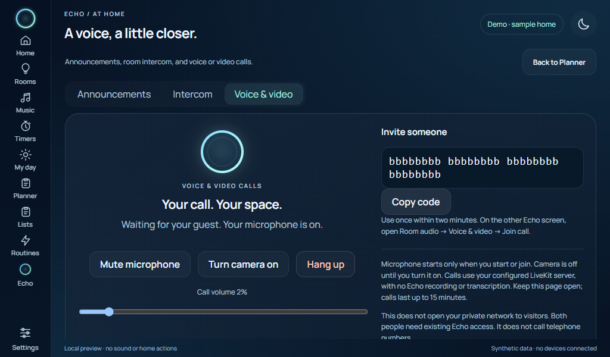

# Voice and video calling

Echo Deck and browser displays can make two-person calls through an optional
[LiveKit](https://livekit.io/) server. Use LiveKit Cloud or a self-hosted server.
The feature is off by default and keeps Echo's own interface, microphone controls,
and quiet starting volume. It is separate from [household intercom](ROOM_AUDIO.md).

This first integration connects people who **already have access to the private
Echo UI**. It does not expose Echo or Hermes to the internet, invite new Tailscale
members, provide a public guest page, or call telephone numbers. A phone can join
using an existing permitted HTTPS connection. Mini does not run this browser SDK;
its separately implemented room intercom remains the Mini calling option.

The screenshot uses synthetic participants and media. It does not show a completed
physical call.

## Set up a provider

An optional managed server is deployed on the existing private Docker host.
Its [private deployment notes](PRIVATE_CALLING.md) describe the exact-origin
binding, device restrictions and credential recovery. The deployed route passed
a silent two-participant ICE/TCP check; real two-device sound/video is still
unverified. Fresh installations keep calling off until explicitly configured.

1. Create a LiveKit project or configure a server using the
   [official self-hosting guide](https://docs.livekit.io/home/self-hosting/deployment/).
   Use a valid HTTPS/WSS certificate, a strong API secret, and the provider's
   required ICE/TURN networking. Running only the signalling port does not prove
   that media can traverse a firewall. Echo does not change these network rules.
2. Open the owner **Display → Settings → Optional calling → Configure calls**.
   Enter the WSS server origin, API key and secret. Select the paired Household
   displays that may call. Enable calling and save.
3. Reload each calling display. The response's connection policy then permits
   the chosen provider. For a self-hosted server this is the exact WSS/HTTPS origin;
   LiveKit Cloud also needs its `*.livekit.cloud` regional signalling origins.
4. On both devices open **Planner → Room audio → Voice & video**. The caller taps
   **Start voice call** and privately shares the displayed code. The other person
   pastes it and taps **Join call** within two minutes. No microphone permission
   is requested just by opening the page or configuring the provider.

Use a secure browser context: HTTPS on phones, or the Pi's loopback kiosk bridge.
Browser microphone/camera permissions are separate from Echo's display permissions.
Each device needs its own connected microphone and playback hardware. The camera
starts off; turn it on explicitly after joining. There is no automatic answer or
background incoming-call listener. This flow uses invitation codes rather than
ringing another person's phone.

Call volume starts at **2%** on each page load and can be set from 0–30%. A browser
that blocks automatic sound shows **Enable call sound**. Pi music focus pauses
Spotify and its native wake listener while the browser holds a call. Assistant
capture and room intercom stay busy until it ends. Calls keep the screen awake.
Headphones or an echo-cancelled microphone are recommended for usable duplex audio.

## Access and lifetime

- Owner configuration is encrypted in `local/echo-calling.json`, included in
  protected backups, and never returned in API responses. Blank credential fields
  keep saved values. A different server requires both credentials again. To remove
  them, disable calling and select **Remove saved credentials**.
- Owner sessions and explicitly allowed paired Household displays may call.
  Guest and Personal profiles cannot call. Invitation codes do not replace Echo
  authentication. They are random, one-use, and expire after two minutes.
- Provider tokens last 60 seconds for initial connection and are restricted to
  one randomly named room, microphone/camera publication, and subscription.
  They cannot create or delete rooms, send data, or publish screen sharing.
  No household names, chat content, or device identifiers are sent to LiveKit.
- Echo keeps call state only in host/browser memory. Calls close when a participant
  hangs up, leaves/hides the calling page, loses Echo access, changes profile, or
  reaches 15 minutes. The server checks missing heartbeats after 20 seconds and
  retries room deletion after provider errors. Browser tracks close immediately
  even if deletion fails. There is no automatic resumption after a restart.
- Room deletion requires a reachable provider. A host crash or provider outage
  can delay server cleanup; token expiry alone does not disconnect an established
  LiveKit session. The browser also enforces the call deadline. These are lifecycle
  controls, not a guarantee that the provider has stopped all processing instantly.
- Echo does not record or transcribe calls. Media travels through the configured
  provider with WebRTC transport encryption; application-level end-to-end encryption
  is not enabled. Review the chosen provider's privacy and billing terms.

Provider/access changes are rejected while calls or pending provider cleanup exist.
End calls first. A revoked display/profile is checked independently by the call
reaper and its API heartbeat, so changing display access does not depend on a page
cooperating. Call creation is capped at four rooms per host and two peers per room.

## Software verification and open acceptance

`tests/test_calling.py` covers stored-key encryption/redaction, strict origin
validation, owner/paired/Guest boundaries, short grants, one-use invitations,
revocation, stale clients, expiration and cleanup retries. The silent
`tools/check_display_calling.cjs` uses synthetic media and covers quiet attachment,
camera/mute controls, permission-prompt cancellation, access loss and phone layout.

`tools/check_calling_provider.py --context YOUR_CONTEXT --host-image YOUR_ECHO_IMAGE`
uses LiveKit server **1.13.7**, pinned by image digest, with no published ports or
external network. It checks room limits, a real participant WebSocket handshake,
admin-action denial, and room deletion. It sends no microphone, camera or RTP data
and removes the temporary containers afterward. It requires a prebuilt Echo image.

The client is the official **livekit-client 2.22.3** UMD bundle, served locally;
there is no runtime CDN or unreviewed installation script. The source archive's
SHA-512 integrity was verified. Bundle SHA-256:
`7fa17e37af5e996d8a25f15a637dcc0620215bc01b394e5d209f726afe7dc04d`.
See [third-party notices](../THIRD_PARTY_NOTICES.md).

The managed private provider is provisioned, and its deployed gateway passed
the real ICE/TCP connection check with two synthetic browser participants. The
owner start/end API and paired Deck access also work. Cloud/regional failover, two-device sound/video,
camera framing, echo cancellation and mobile background behaviour still require
acceptance. Current software deliberately ends a call when the page is hidden.
An isolated signalling check is not a media-quality or public-internet test.
