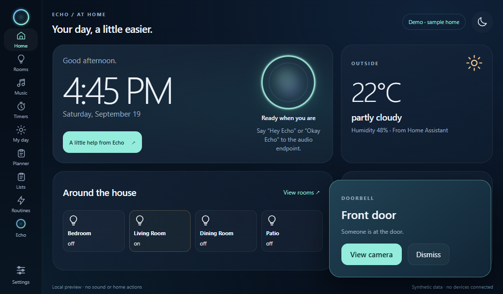

# Cameras and doorbells

Echo displays can show a selected Home Assistant camera as a live MJPEG view or
as snapshots refreshed every five seconds. Doorbell presses create silent cards
with a **View camera** button and a dismissible activity history.

## Connect your sources

1. Add the camera and doorbell integration to Home Assistant and verify them there.
2. In the owner workspace, open **Display → Settings → Calendars & cameras → Load sources**.
3. Select the cameras to share. Under **Doorbell notifications**, choose only an
   entity that reports an actual doorbell press, give it a display name, and
   optionally associate a selected camera. Save the display sources.
4. Open **My day**, select a camera and view mode, then tap **Open view**.

An `event` entity whose state is the press timestamp is preferred. A
`binary_sensor` works when a press changes it from `off` to `on`. Echo observes
selected triggers every 1.5 seconds; very short binary pulses can be missed.
Motion sensors are not automatically treated as doorbells. Sources remain
unselected until the owner explicitly chooses them.

## What a ring does

A recent press shows a silent notification card on paired displays. **View camera**
navigates to My day and opens the associated, still-permitted camera. A press does
not automatically open a camera, play sound, record video or actuate a home device.

The latest 100 events are retained in encrypted host storage and appear under
**My day → Doorbell activity**. Dismissal is shared across displays. Removing a
doorbell selection immediately hides its history; the observer removes those
records on its next successful update. Restart/reconnection establishes a baseline
without turning old trigger states into new rings. Events during an outage are
not backfilled. This is a convenience notification feature, not a security alarm.

## Streaming and privacy

Echo relays Home Assistant's `/api/camera_proxy_stream/{entity_id}` endpoint.
MJPEG availability and frame rate depend on the camera integration; an integration
may itself generate that stream from still images. RTSP, HLS and WebRTC sources
need a compatible Home Assistant camera integration. Choose **Snapshots** when
MJPEG is unsupported. Camera audio, recording and two-way talk are not included.

The host keeps the Home Assistant credential out of the browser and only requests
the selected camera from the configured local HA origin. Redirects are rejected.
The relay accepts bounded JPEG parts and emits normalized multipart frames, with
at most three concurrent views, 5 MB per frame and 128 MB per stream. Sessions renew
after 100 seconds; a stalled feed is cleared rather than shown indefinitely as live.
Display credentials and camera selection are checked throughout the stream.

Frames stay in memory. Closing the view, changing pages, hiding the tab or entering
the ambient screen aborts capture and removes the last image. The Pi bridge forwards
available chunks immediately rather than waiting for a large response buffer.

## Verification and remaining acceptance

Focused software checks cover split MIME boundaries, invalid/oversized frames,
redirect refusal, authorization, revocation during a stream, cleanup, first
presses, reconnect behavior, encrypted history and source removal. Silent browser
checks use moving JPEGs generated locally and verify live/snapshot modes, stopping,
source selection, notification cards, explicit camera opening and dismissal.

Actual cameras, doorbell presses, their frame rates and network recovery still
require acceptance with configured hardware. The current installation has no
Home Assistant camera entities; no real camera was opened by these checks.
