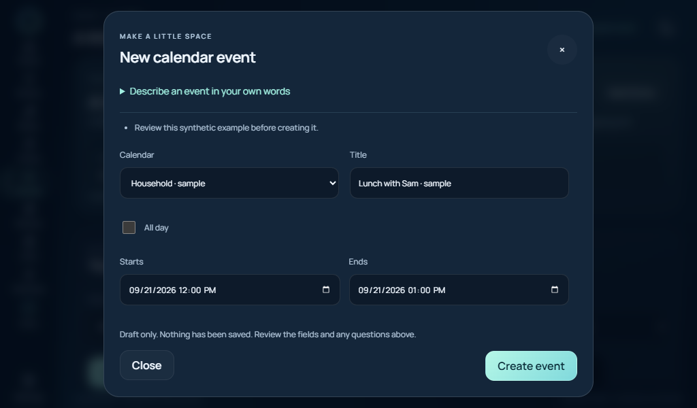

# A daily briefing and calendar that respect your settings

Open **My day** for a short overview of current weather, remaining calendar events,
today's alarms/reminders, unfinished tasks and shopping-list counts. Echo composes
this locally from its existing integrations. It names sources it couldn't reach
instead of inventing their contents. Results refresh at most every 30 seconds and
show their update time and time zone.

You can also type or say **“Give me my daily briefing”** or **“What's on my agenda
today?”**. These requests use the same local composer, without a model call. The
briefing stays out of the model's conversation history. Speech still requires a
working microphone, speech runtime and output endpoint.

The display uses its browser's time zone. Voice briefings use Home Assistant's
configured time zone, falling back to Echo's schedule time zone if it cannot be
read. Calendar date-only events remain all-day events in the selected day.

## Choose calendars, then choose whether Echo can create events

You can also [connect Google Calendar directly](GOOGLE_CALENDAR.md). Its current
integration supplies read-only sources to this same agenda and briefing. Google
write operations remain open; the creation/editing controls below apply to
supported Home Assistant calendars with explicit write grants.

In the owner's display workspace, open **Settings → Calendars & cameras → Load
sources**. Sharing a calendar gives displays read access. A second checkbox,
**Allow event creation from Echo displays**, appears only for calendars whose
Home Assistant integration supports creating events. Existing installations gain
no write permissions automatically. Paired displays cannot change these grants.

Open **My day → New event** and select a writable calendar. Enter a title, dates,
time zone, and optional location or notes. **Create event** submits these exact
fields through Home Assistant. The form supports timed and all-day events; for
all-day events, **Ends** is the last included day. Echo converts it to Home
Assistant's exclusive end date. For a repeated hour when clocks go back, advanced
options select the first or second occurrence. Nonexistent spring-forward times
are rejected rather than silently moved.

## Describe an event

On the smart display, say or type **“Add lunch with Sam tomorrow at noon for an
hour to my calendar.”** Echo returns a **Review calendar draft** button in that
conversation. Pi wake-word replies and push-to-talk return the same editable draft.
You can also open **New event → Describe an event in your own words** and choose
**Draft from words**. The title, dates, time zone, location and notes remain editable.

Drafting uses the provider and model selected in Echo Settings, including when
Hermes is selected for conversation. It is a separate extraction call without
agent tools, web search, saved memories or prior conversation. Only the description,
current time and reference time zone go to that provider. A local compatible model
can keep that extraction on the configured local server. If drafting is unavailable,
the manual form still works. Older Mini firmware directs calendar requests to the
smart display. [Mini firmware 0.17.0](ROUND_CALENDAR.md) adds paginated review and
explicit creation; its installation and physical acceptance remain pending.

Relative dates use the form's time zone. Spoken/chat requests use Home Assistant's
time zone, falling back to the schedule time zone. Missing or ambiguous details
appear as questions. A missing end may receive a clearly labelled one-hour suggestion
(one day for all-day events); review it. Invalid intervals and clock changes are
flagged, and multiple writable calendars require selection unless one was named
unambiguously. Models can still misunderstand a request, so check every field.

**Drafting never creates an event.** Only **Create event** submits the reviewed
form through the existing write grant and duplicate-protection checks. Drafts are
not saved in Echo memory or calendar storage. Review buttons expire after 15 minutes;
the Pi retains its latest voice result for only two minutes. The browser keeps its
conversation/form in that tab until reload. Closing a pending draft cancels its
model request, and a delayed response cannot overwrite a newly opened form.

Event editing/deletion and bounded recurring creation are available through the
reviewed touch forms. See [Calendars](CALENDARS.md) for occurrence scopes and
provider limits. Invitation management remains open.

## What “accepted” means

A successful service response means Home Assistant accepted the event. Its calendar
integration may take time to sync it into the agenda. Echo does not claim to have
read back and independently verified the new event.

Before dispatch, Echo saves an encrypted receipt containing a request fingerprint.
The same request identifier is never dispatched twice, including after a restart
or browser sign-in. If the connection fails, retrying the same form uses that same
identifier. An uncertain result tells you to check the calendar before starting a
new event. Corrupt or unwritable receipt storage stops creation; it is preserved
for recovery. The bounded receipt store supports 4,096 distinct requests and stops
accepting new ones when full rather than silently discarding duplicate protection.

The server checks the current source revision, write grant, calendar availability
and Home Assistant's `CREATE_EVENT` capability before sending a request. Validation
hosts never create real events. No calendar credentials reach the browser.

## Integration references and verification

The implementation follows Home Assistant's
[calendar service fields](https://github.com/home-assistant/core/blob/dev/homeassistant/components/calendar/services.yaml)
and [calendar capability flags](https://github.com/home-assistant/core/blob/dev/homeassistant/components/calendar/const.py).
It uses the local `calendar.create_event` service; Google Calendar or another calendar
account must already be connected through a compatible Home Assistant integration.

Synthetic tests cover permission boundaries, service payloads, duplicate requests
across restart/sign-in, uncertain responses, failed receipt writes, all-day dates,
clock changes, partial briefing data, and keeping briefings out of model history.
Browser checks cover the touch form, separate permissions and phone width. Live
calendar creation and spoken briefing playback have not been physically accepted.
Draft checks also cover tool-free extraction, invalid/refused/incomplete model
output, calendar selection, clock changes, display authorization, and explicit
submission from the form/chat UI. One synthetic request returned correct event
fields from the configured Azure model; no real event was created. OpenAI/Azure
requests follow the [Structured Outputs format](https://developers.openai.com/api/docs/guides/structured-outputs);
local and Anthropic JSON replies receive the same server-side validation.

For recurring creation, event details, edits and confirmed deletion, see
[Calendars on Echo](CALENDARS.md). The ordinary one-off form still uses the
create-event service; recurrence and changes use the calendar WebSocket API.
Occurrence/following edits and explicit series deletion are supported where the
integration allows them. Master-event editing, counted-series rescheduling and
invitations remain unavailable.
