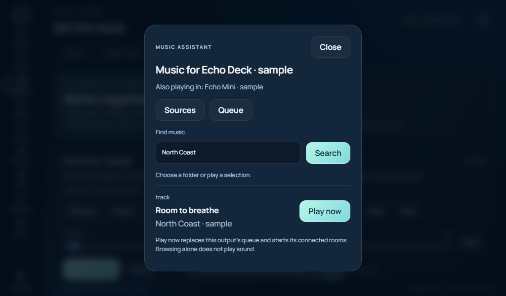

# Music in more than one room

**Music → Together** connects Echo to a private [Music Assistant](https://www.music-assistant.io/)
server. It shows shared players, track titles, current groups, transport controls,
mute and volume. Choose **Choose rooms**, review the outputs, then **Apply group**.
A playing source can become audible in a room as soon as it joins.

Echo uses the players' advertised grouping support. Compatible native groups can
provide synchronized playback; combining unrelated protocols does not guarantee
synchronization. The controls do not convert an ordinary Spotify receiver into a
Music Assistant player.

## Connect a server

1. Install Music Assistant using its [installation guide](https://www.music-assistant.io/installation/).
   The Echo adapter is checked against server **2.10.4**. Complete its first-run
   setup and add the players and music providers you want to use.
2. Create a dedicated regular user and an integration access token in Music
   Assistant. Keep its administrative account separate. Long-lived tokens in this
   version expire after one year; replace an expired token in Echo Settings.
3. In Echo's owner workspace, open **Settings → Music Assistant → Connection &
   outputs**. Enter the private server origin and token, enable the connection,
   and save. Use an explicit private IP, or `http://echo-music:8095` when both
   services run on Echo's Docker network. `localhost` means the API's own host or
   container, not the browser's computer.
4. **Load outputs**, select the players Echo may control, then **Save shared
   outputs**. New or unselected players are not automatically shared.
5. Open **Music → Together → Choose music** on the desired output. Browse its
   connected providers or search for tracks, albums, playlists and radio. Choose
   **Play now** to replace that output's queue and start playback. **Queue** shows
   the current items and lets you select one to play. Existing Spotify Connect
   and local-media tabs remain separate playback paths.

The token is encrypted on the Echo host and is not returned to the browser. A
changed server origin requires a new token entry. Requests do not follow redirects
or system proxies. Music Assistant remains responsible for its own users, provider
accounts, library and player configuration.

Browsing and searching never start playback. Queue pages show 50 items at a time;
provider folders show up to 100 entries, with search for narrower results. Echo
keeps provider media URLs on the host and issues temporary selections scoped to
the requesting display and output. A changed group or permission requires a fresh
selection. Playback requests are single use, including after an uncertain response.
This browser uses the providers already connected to Music Assistant; it does not
sign into Spotify or import credentials from Echo's separate Connect receiver.



## Private Docker option

The optional [music overlay](../deploy/host/music.yaml) pins the image and stores
Music Assistant data in its own persistent volume:

```sh
docker compose -f deploy/host/compose.yaml -f deploy/host/music.yaml up -d music
```

This only starts the service. It deliberately publishes no port and is not a
complete endpoint-discovery or first-run setup solution. Configure it through an
authenticated management path on the Docker host, or use an already configured
private Music Assistant server. The Echo API can reach its internal port 8095.
Do not expose an unfinished setup page or unauthenticated Sendspin listener to a
shared network. A bridge network does not carry LAN multicast discovery by itself.

Music Assistant's `/data` volume contains its separate account and provider state.
Back it up using Music Assistant's supported backup workflow. Echo recovery
archives include only Echo's encrypted connection settings and selected outputs;
they do not back up the Music Assistant database, library or service credentials.
Stopping the optional service leaves Echo's existing Spotify path available.

## What the controls protect

- Only the owner can configure the connection or discover and share new players.
  Trusted Household displays can control shared outputs. Guest displays have no
  grouped-music access in this version.
- Commands are rejected when a group includes an output not shared with Echo.
  Review those groups in Music Assistant before controlling them through Echo.
- Group changes recheck availability, membership and permissions after the review
  dialog. Echo refuses incompatible outputs and does not automatically move a
  speaker out of another group.
- The owner can cap new volume commands. This is a control limit, not an acoustic
  limiter: it does not lower an amplifier, existing player volume or volume changes
  made in other applications. Start with a low level on each physical device.
- A command acknowledgement means Music Assistant accepted the request. The next
  refresh reports the player's state; it does not prove that a speaker was audible.
  Uncertain network responses are not retried automatically.

## Add an Echo Deck player

The optional native Pi client connects through the **existing authenticated Echo
connection**. It does not need a second exposed port, multicast discovery or a
Music Assistant token on the Pi. The host restricts each connection to its paired
player identity, and Guest profiles cannot use this route.

The packaged runtime currently targets **64-bit Linux on the Pi with Python 3.13**:

```sh
sudo apt-get install --no-install-recommends libportaudio2
python3 deploy/pi/install_group_music.py
```

The installer uses a wheel hash lock and a separate environment. It installs only
the client/audio modules needed by Echo; the full Sendspin application, server,
MPRIS controls and discovery are not used. It neither enables playback nor changes
voice settings. Update the Pi to the current [display bundle](SMART_DISPLAY.md).

1. In owner **Settings → Music Assistant → Connection & outputs**, allow the
   paired display to receive grouped audio and save the connection.
2. On that Pi, open **Settings → Join the music**, select its attached output,
   choose a player name and a low output ceiling, then enable grouped playback.
   For the shared echo-cancellation route, select the processed output described
   in [Pi audio](PI_ECHO_AUDIO.md).
3. Return to owner Settings, **Load outputs**, and share the newly available
   player. Music Assistant may represent it with a universal-player identity;
   select the discovered player rather than constructing an identifier by hand.
4. The player appears under **Music → Together**. Select **Choose music**, then add
   compatible outputs through **Choose rooms**.

Each Pi enforces its local output ceiling in software even if the server requests
a higher volume. Echo uses linear attenuation, starting at 2%. Voice duck mode
reduces amplitude by 80% on this endpoint, with a short fade; local audio focus
silences it for other voice/alert activity. Spotify playing on this Pi takes
priority. Other rooms keep their own level and timing. The native client stays
synchronized while locally quiet, then returns at the current playback position.
If the local focus bridge becomes unavailable, grouped output stays muted.

Clock, connection and focus state are transient. The client does not save audio,
track history. No Music Assistant token is stored on the Pi. Disconnecting or revoking access tears down its
audio worker and clears buffered playback. After a profile or pairing change, the
host rechecks access at least twice per second; reconnecting requires permission.

## Current endpoint status

The Pi client is installed and has registered with Music Assistant 2.10.4 through
the private Echo gateway. Its clock synchronized, the output ceiling remained 2%,
and the existing voice listener and Spotify receiver stayed available. No audio
chunks were sent during this connection check. An in-memory check of the actual
pinned audio engine verified 2% attenuation, 80% ducking and mute without opening
an audio device. These checks do not establish audible playback or timing between
physical speakers.

The Mini's [host receiver and firmware transport](ROUND_GROUP_MUSIC.md) are now
implemented, including owner settings, metadata, shared-output music controls
and local voice priority. The receiver stays disabled pending installation of
firmware 0.16.0 and physical acceptance. Actual multi-speaker listening, latency
calibration and long-session drift remain in the build queue. Existing Spotify
Connect destinations remain separate; this change
does not automatically share their incoming Spotify stream with Music Assistant.
