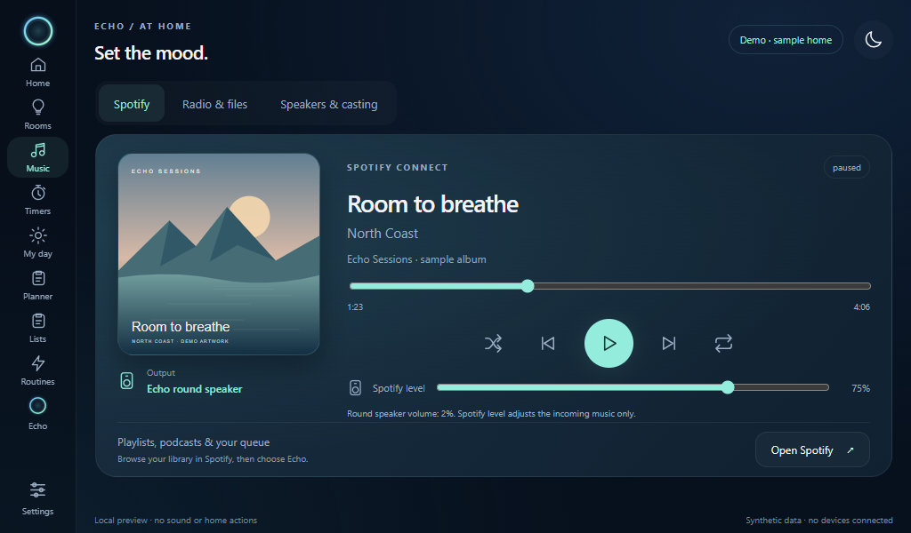

# Music on the smart display

Open **Music** in the display sidebar. The page separates playback sources and destinations:

- **Spotify:** current cover art, title, artist and album; progress and seeking;
  previous/play/pause/next; shuffle; repeat off, context or one track; Spotify input level.
- **Radio:** search stations by name, country or genre, save favorites, or use shared HTTPS presets.
- **Files:** automatically browse the Pi’s `~/Music/Echo` folder, songs and M3U playlists; queue or shuffle music, or choose files from the browser.
- **Speakers & casting:** select an assigned Home Assistant speaker, see its
  playback state and available metadata, and use play/pause, mute and volume steps.

The Pi build is intended to play music through its **own attached speaker**.
Radio and local files use its browser output. The [Pi Spotify adapter](PI_SPOTIFY.md)
adds a separately named receiver and an explicit ALSA output. It starts disabled
until configured in Settings; real Spotify playback still needs physical acceptance.

The existing Spotify Connect receiver currently sends audio to the **optional
round Echo speaker**. Select **This display** for the Pi or **Round speaker** for that separate build. The
Spotify level attenuates its incoming stream, independently of the round speaker's
hardware volume. The page displays both when the hardware reports its volume.

To send music from your phone, open Spotify and choose the output name shown
in Echo from Spotify's device picker. Keep both devices on the same home
network for the first connection. The generic Spotify QR launcher has been
removed because it did not authorize or pair the device.

For browsing inside Echo, **Your Spotify** connects an account
through Music Assistant and offers playlists, albums, search and queue selection.
The connection is saved in Music Assistant’s persistent data volume. Complete
the owner-only **Connect account** steps once, then choose a shared output.
See [Radio, SD music and Spotify account setup](MUSIC_LIBRARY.md).

Chromecast and AirPlay receivers are not included. Existing Cast speakers can
still receive audio from their normal apps; Echo can control the assigned Home
Assistant speaker where its integration supports those actions.

## Receiver and privacy

The pinned librespot 0.8.0 build forwards a small allowlist of authenticated
current-track events through its private localhost channel. The receiver exposes
the new controls through its existing bounded stdin pipe. Rebuild it using
`tools/build_receiver.py`, or rebuild the host image, when upgrading from the
earlier receiver. Extended controls stay unavailable until that receiver reports
the matching capability version.

Track information is separate from diagnostic health data. A current-state file
is replaced once per second; there is no listening-history database. In Docker it
lives under `/run/echo`; other installations use ignored `local/` runtime state.
Readers reject it after eight seconds without an update. A clean receiver shutdown
removes it. Restart or disconnection clears the metadata shown on screen.

Artwork requires an authenticated owner or paired display. Only the current
Spotify image CDN URL is accepted; redirects and arbitrary URLs are rejected.
Downloads are bounded, decoded and resized to JPEG, with one cover cached in RAM.
Album art is not written into logs, browser storage or the repository. The example
album shown here is synthetic.

## Validation

### Music Assistant library playback

The main player follows the selected library output, including artwork and
elapsed time. On a Pi it also follows an active or resumable queue matching the
local receiver. Queue pause preserves its resume position even when Sendspin
closes the stream. The track remains visible while paused or ready to resume.

The Pi Sendspin adapter uses a 100 ms PortAudio block and a 500 ms requested
output buffer. Startup underruns preserve queued timestamped PCM, avoiding a
repeated reset to Music Assistant's future prebuffer window. Actual latency is
reported by the device. This is a playback buffer, not a voice-latency setting.
Live Deck listening improved, and the paused track and cover art were verified
on its display. These results do not establish multi-room synchronization.

### Spotify Connect

The native receiver compiled and its metadata escaping test passed. Focused Python
tests cover metadata expiry, playback position, URL restrictions, cover decoding,
cache invalidation, command bounds, generation checks and API authorization. Silent
browser checks cover the 1024 × 600 player, its controls, source tabs, disconnected
fallback and phone layout. No physical playback or home actions are part of those
checks. Live Spotify artwork/control acceptance remains to be checked with actual
playback on the connected round speaker.
