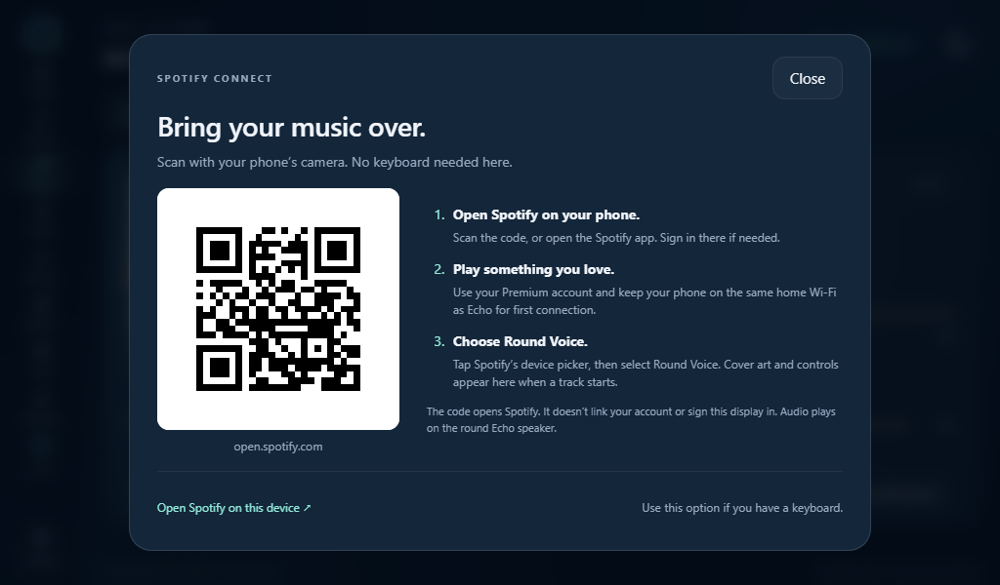

# Music on the smart display

Open **Music** in the display sidebar. The page separates three destinations:

- **Spotify:** current cover art, title, artist and album; progress and seeking;
  previous/play/pause/next; shuffle; repeat off, context or one track; Spotify input level.
- **Radio & files:** saved direct HTTPS stations and supported audio/video files
  played by this display. Files remain in its browser session.
- **Speakers & casting:** select an assigned Home Assistant speaker, see its
  playback state and available metadata, and use play/pause, mute and volume steps.

Spotify Connect currently sends audio to the **round Echo speaker**. The Pi controls
that receiver; it does not yet become a separate Spotify audio destination. The
Spotify level attenuates its incoming stream, independently of the round speaker's
hardware volume. The page displays both when the hardware reports its volume.

On a touchscreen without a keyboard, tap **Connect with phone**. Scan the QR code
with your phone's camera, sign in to Spotify there if needed, start music, and
choose **Round Voice** (the receiver's advertised name) in Spotify's device picker. For the first connection, keep the phone
and Echo on the same home network. The code is a static link to
`https://open.spotify.com/`; it is generated locally, contains no credentials,
and does not perform device authorization or sign the display into an account.
You can also open the Spotify app directly without scanning.

**Open Spotify on this device** remains available inside that dialog for browsers
with a keyboard. It opens the current track or episode, or Spotify itself if
nothing is selected. Playlists,
search, saved tracks and queue browsing remain in Spotify. Echo has no Spotify
library OAuth integration and does not pretend to show a library or queue.

Chromecast and AirPlay receivers are not included. Existing Cast speakers can
still receive audio from their normal apps; Echo can control the assigned Home
Assistant speaker where its integration supports those actions.

## Receiver and privacy

The pinned librespot 0.8.0 build forwards a small allowlist of authenticated
current-track events through its private localhost channel. The receiver exposes
the new controls through its existing bounded stdin pipe. Rebuild it using
`tools/build_receiver.py`, or rebuild the host image, when upgrading from the
earlier receiver. Extended controls stay unavailable until that receiver reports
the matching capability version.

Track information is separate from diagnostic health data. A current-state file
is replaced once per second; there is no listening-history database. In Docker it
lives under `/run/echo`; other installations use ignored `local/` runtime state.
Readers reject it after eight seconds without an update. A clean receiver shutdown
removes it. Restart or disconnection clears the metadata shown on screen.

Artwork requires an authenticated owner or paired display. Only the current
Spotify image CDN URL is accepted; redirects and arbitrary URLs are rejected.
Downloads are bounded, decoded and resized to JPEG, with one cover cached in RAM.
Album art is not written into logs, browser storage or the repository. The example
album shown here is synthetic.

## Validation

The native receiver compiled and its metadata escaping test passed. Focused Python
tests cover metadata expiry, playback position, URL restrictions, cover decoding,
cache invalidation, command bounds, generation checks and API authorization. Silent
browser checks cover the 1024 × 600 player, its controls, source tabs, disconnected
fallback and phone layout. No physical playback or home actions are part of those
checks. Live Spotify artwork/control acceptance remains to be checked with actual
playback on the connected round speaker.
