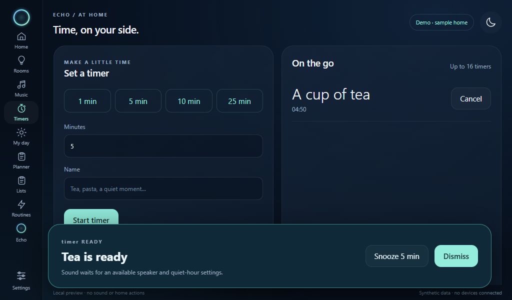

# Timers and reminders on the Pi

Timers created through a paired Pi's screen, chat or voice request belong to that
Pi. New Planner schedules and audible household messages use the same destination.
The destination is saved across host restarts. Editing an existing schedule keeps
its destination; existing schedules and owner-workspace timers retain their round
speaker destination. A missing Pi never sends its alert to another room.

## Enable the attached speaker

Install the current `deploy/pi` bundle with `python3 deploy/pi/setup.py --install`.
It includes the native alert worker, which runs with the paired loopback bridge.
The Pi needs `alsa-utils` and its own speaker or audio interface.

Open **Settings → Alarms on this Pi**, choose the attached ALSA output, leave
the initial level at **2%**, enable chimes and save. Chimes are disabled by
default. This setting is independent of enabling Spotify; select the same
physical speaker for both if that is your build's output. A missing configured
output stays unavailable and does not fall back to HDMI or another device.

When a timer or reminder is due, the Pi plays two soft, fading notes and shows
the title/message with **Snooze 5 min** and **Dismiss**. A reminder uses a chime
and visible text; this adapter does not read its message aloud. The round build
retains spoken alerts. The Pi worker continues through browser refreshes.

Spotify pauses before a chime and remains paused afterward. A microphone session
or intercom call takes priority; chimes wait while that session holds audio.
Quiet hours suppress reminder sounds. Alarms and countdown timers can bypass
quiet hours only when **Allow alarms during quiet hours** is enabled. Dismissing
or snoozing a playing alert stops its next delivery check. The visual timer and
notification pages remain available with chimes disabled.

## Delivery and recovery

Schedules live on the host, so the Pi needs its private host connection for sound.
There is no offline alarm clock in this version. A delayed alert may sound within
15 minutes of its due time; older occurrences remain visual or are marked missed.

Delivery claims are scoped to the paired display and occurrence. A completed
player reports a receipt; this means ALSA accepted playback, not that a person
heard it. A failed output or interrupted chime remains unacknowledged and retries
after a delay. A lost receipt is retried without replaying the sound while the Pi
worker remains running. An abrupt crash before a receipt is saved can cause a
retry after restart. Snoozing creates a new occurrence so an old receipt cannot
silence the snoozed alarm. Revoked display credentials stop new deliveries.

Output settings are private files on the Pi. The worker opens no microphone,
stores no recordings, and generates its chime locally without speech models.
Do not downgrade the host to a version that predates destination routing while
Pi-targeted timers or schedules exist: older versions cannot preserve that
routing. Preserve the current host image and saved state for recovery.

## Verification

Synthetic checks cover destination persistence, old-state migration, quiet
hours, late delivery, cross-device rejection, snooze races, chat timer dispatch,
pairing revocation, native player cleanup and receipt retry. Browser checks cover
settings and the alert controls at 1024 × 600 and phone width. They open no audio
hardware. Physical chime audibility, the chosen speaker and acoustic coexistence
with the microphone remain unverified until the Pi hardware is attached.
