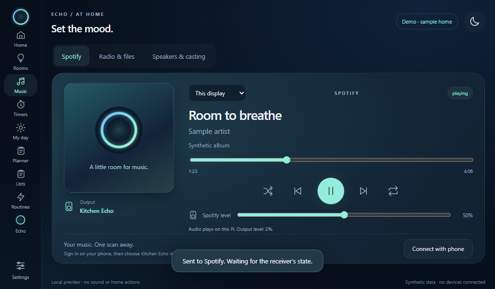

# Spotify through the Pi speaker

The Pi has its own Spotify Connect receiver, independent of the round speaker.
In **Music → Spotify**, **This display** controls the local Pi receiver; **Round
speaker** explicitly selects the existing round receiver. There is no automatic
switch to another room when an output is missing.



## Install the receiver

Use a 64-bit Linux Pi OS and install `alsa-utils` for its `aplay` output. The
receiver is compiled on a Docker host so build tools and compiler caches do not
consume the Pi's SD card. From the repository on that host, run:

```bash
python tools/build_pi_receiver.py
```

Use `--docker-context YOUR_CONTEXT` for another Docker host. The helper sends
only the pinned build files and checksum-verified librespot source. It writes
`output/pi-receiver/echo-librespot`, `SHA256SUMS` and the upstream MIT license.
The target is ARM64 Linux; this executable is not for 32-bit Pi OS.

Copy those files and `deploy/pi` to the Pi. As the normal desktop user, install
the executable using the SHA-256 value from `SHA256SUMS`:

```bash
python3 deploy/pi/install_receiver.py --binary ./echo-librespot --sha256 YOUR_BUILT_BINARY_SHA256
python3 deploy/pi/setup.py --install
```

Pair the Pi first if this is a new display installation. The installer verifies
the checksum and architecture, preserves an existing executable as
`echo-librespot.previous`, and does not enable playback. Normal bundle rollback
still works without modifying the original SD backup or display pairing.

## Select the attached output

1. Attach the Pi's speaker or audio interface.
2. Open **Settings → Spotify on this Pi** on that Pi's display.
3. Choose its named ALSA output and a Spotify name such as **Kitchen Echo**.
4. Keep the initial output volume at **2%**, check **Enable this Spotify receiver**,
   and save. Changing its name or output restarts only that receiver.
5. Open Spotify on your phone, start a track, and choose the configured name in
   Spotify's device picker. Spotify Premium is required. Use the same LAN for
   initial discovery. The on-screen QR opens Spotify on the phone; it is not an
   account-linking code.

The output selector lists ALSA names without opening a device. A missing output
stops playback rather than selecting HDMI, headphones or another endpoint.
PulseAudio/PipeWire users may choose their system's shared output; direct hardware
outputs can be exclusive. Verify that voice replies and music can share the
selected physical device. The dedicated kiosk passes the Pi voice settings'
explicit input and output to Chromium when it starts, including browser media
and calls. Restart the kiosk after changing those selections. Choosing a Spotify
output alone does not change Chromium; other browsers use their own audio settings.

The Spotify slider controls the incoming stream. **Output volume** is a separate
Pi attenuation control, limited to 30%. These controls do not change an external
amplifier's physical volume.

## Voice, calls and privacy

For music that continues quietly while Echo listens, create a shared ALSA output:

```bash
aplay -l
python3 deploy/pi/setup_shared_audio.py --card YOUR_ALSA_CARD_NAME
```

The helper adds the named `echo_shared` mixer to your user's ALSA configuration,
preserves unrelated configuration, and backs up an existing file. It does not
change the system default or play sound. Select **Echo shared speaker** for both
Spotify and Pi voice, then choose **Lower music by 80%** in Pi voice settings.
This allows the cue and reply to play over quieter music. The mixer expects a
stereo output capable of 48 kHz; verify that your selected interface supports it.
Use pause mode with direct, exclusive hardware outputs.

Native wake words work during music. Duck mode reduces the Pi's PCM output to
20% of its configured level, then restores it when the interaction ends. A short
fade avoids abrupt level changes; expired voice leases also release the reduction.
The headset/speaker still needs an appropriate microphone placement or echo
cancellation to avoid false wakes from playback.

Browser microphone sessions, calls and announcements pause Pi Spotify and close its
output stream. Calls and announcement delivery use the same coordination.
Playback remains paused afterward; press Play or use Spotify to resume. If the
host cannot confirm the pause request, capture does not start. Tab focus leases
expire after 15 seconds, but expiring a lease never automatically resumes music.

Local music controls retain the display's pairing check and browser origin
protections. Spotify's own authenticated LAN receiver is a separate connection.
No microphone audio is sent to Spotify. Track metadata and cover art remain in
memory; bounded covers are fetched only from the current Spotify image URL.
The receiver disables its credential and audio caches and uses the user's
private runtime directory for temporary files. After a receiver restart, select
it from Spotify again; account credentials are not persisted by this adapter.

## What has been verified

The ARM64 executable builds from pinned source and starts on the Pi. Synthetic
checks cover stereo PCM attenuation, actual Linux pipe delivery and shutdown,
output selection without fallback, bounded controls, pause-before-microphone,
pairing revocation and UI destination separation. No audio device is opened by
those checks. Real Spotify sign-in/discovery, decoded music playback, audibility
and coexistence with the chosen physical output remain hardware acceptance.
