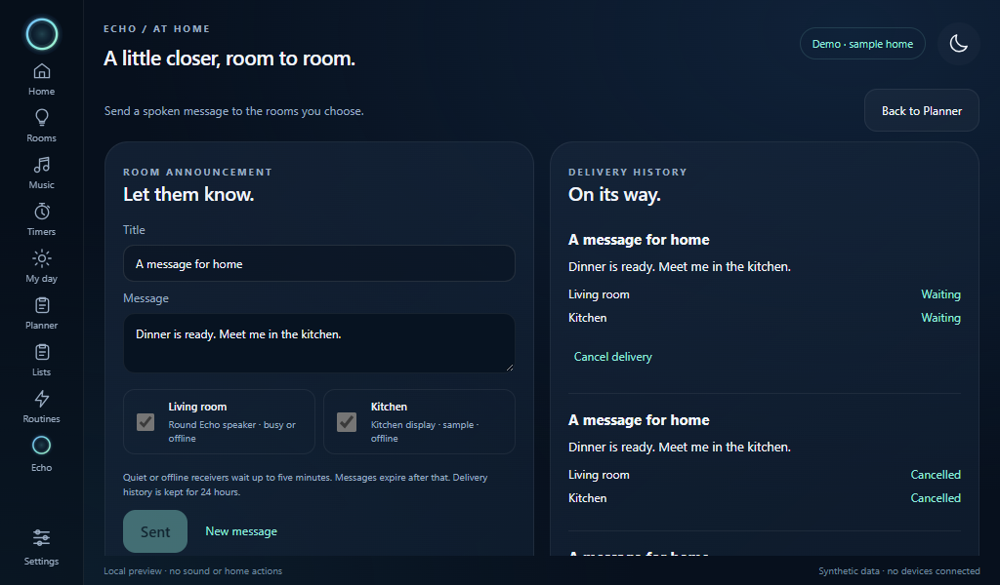

# Room audio

Send a short spoken message to selected Echo receivers from **Planner → Room audio**.
The round speaker and each paired display are separate destinations. An owner
browser can send messages and configure rooms; receiving requires a paired display
or the round speaker bridge.

## Set up receivers

1. In the smart display's owner session, open **Settings → Room receivers**.
2. Give each receiver a room name, check **Announcements**, and save. Nothing is enabled
   automatically in a new installation.
3. On each paired display, open **Settings → Sound on this display** and press
   **Enable announcements here**. This allows browser audio for that session.
   Receiving starts off again after a reload. The initial level is 2%.
4. Keep the round speaker powered and connected. Its microphone mute and speaker
   volume also apply to announcements. Existing timers retain their own behavior.

An enabled receiver may be offline, busy, muted, or in quiet hours. Browser
receiving pauses while recording a voice message, chatting, playing other display
media, or while the tab is hidden. Another enabled tab for the same display must
stop receiving before a second tab can take over; a disconnected tab's receiver
lease expires after 20 seconds.

## Send, cancel, and read results

Select rooms explicitly, enter a message of up to 400 characters, then press
**Send announcement**. Retrying a lost response uses the same request identifier
and cannot create another announcement. Use **New message** for a separate request.
**Cancel delivery** stops queued deliveries and asks active receivers to stop at
their next status check.

Messages wait for up to five minutes. Quiet hours apply to every destination;
alarms' override setting does not override announcements. Expired messages do not
play later. Delivery history lasts 24 hours, with a maximum of 128 announcements.
The round speaker pauses music for delivery and follows its existing resume behavior.

| Result | Meaning |
| --- | --- |
| Waiting | Accepted and awaiting an enabled, available receiver. |
| Delivering | Claimed; synthesis or playback is in progress. |
| Played · receiver report | The receiver reported completion; this is not an audibility measurement. |
| Cancelled | The sender, receiver, quiet-hours check, or removal of access stopped delivery. |
| Failed | Audio could not be generated or played. |
| Unknown · not replayed | A claim expired or the server restarted before completion could be confirmed. |
| Expired | No receiver started delivery within five minutes. |

Messages and receipts use the host's existing encrypted storage. Raw display
credentials and delivery tokens are not stored in the outbox. Audio is synthesized
on the host, shared across the selected rooms, and held only in a bounded memory
cache. Revoked displays cannot retrieve it. Paired displays can view and cancel
their own sent messages; the owner can manage all deliveries.

## Current acceptance

API tests cover scoping, enrollment/revocation, shared synthesis, cancellation
during generation, mute, quiet hours, expiry, encrypted storage, duplicate requests,
and ambiguous delivery after restart. The round adapter uses synthetic WAV data
in tests. Browser checks simulate Web Audio without opening an audio device and
cover send/retry/cancel, assignments, receiving opt-in, interruption, and phone layout.

Physical audibility on both endpoints remains unverified. The Pi needs an
identified speaker/output and microphone for its broader voice features.
## Live intercom between displays

Open **Planner → Room audio → Intercom** to call another paired display.
The owner first assigns rooms and checks **Allow calls** in **Settings → Room
receivers**. Each display then presses **Enable calls here** for its current
browser session. Calls start off after every reload. This permission is separate
from announcement delivery.

Choose an available room and press **Call**. The receiving display shows an
incoming-call card; it opens its microphone only when someone presses **Answer**.
Both people can speak at the same time. **Mute microphone** closes the local
microphone while keeping incoming audio audible. **Unmute microphone** opens it
again. **Hang up** closes the microphone and clears the audio buffers. The initial
playback level is 2%; adjust it on the call page.

A microphone, speaker and browser microphone permission are required at both
ends. Use the installed Pi loopback bridge or an authenticated HTTPS connection.
Browser echo cancellation is requested; actual feedback performance depends on
those audio devices and still needs physical testing. An owner browser cannot
make or receive calls until it is enrolled as a display.

Calls require an explicit answer; there is no unattended listening. Quiet hours
block new calls, and a display using voice capture, replies, announcements or
media reports busy. One enabled tab holds the receiver at a time. Hiding or
leaving the tab, losing its connection, removing its access or reaching the
15-minute limit ends the call. Unanswered calls expire after 30 seconds. Calls
are never automatically resumed after a restart.

The host relays 16 kHz mono audio over the authenticated connection. Audio remains
in bounded memory buffers, with stale packets discarded. It is not sent to speech
recognition, the assistant or a recording file. Call signalling and end reasons
remain only in memory for up to ten minutes, and a restart clears them.

### Intercom acceptance and remaining work

Host checks cover permissions, answer-before-audio, both directions, mute,
revocation, disconnects, duplicate requests and stale packets. Silent browser
checks use synthetic microphones and audio streams to exercise call/answer,
mute/unmute, hang-up, delayed permission cancellation and phone layout. The
worklet's conversion and playback buffers are checked separately. None of these
checks proves audibility on physical hardware.

The [round-speaker call controls and duplex host adapter](ROUND_INTERCOM.md) are
implemented for firmware 0.14.0. Calls remain off by default and require both
owner permission and a local opt-in. The round receiver stays unavailable until
the matching firmware is installed, connected and enabled. Its announcements
are independent. Physical two-way call acceptance remains open for both builds.
