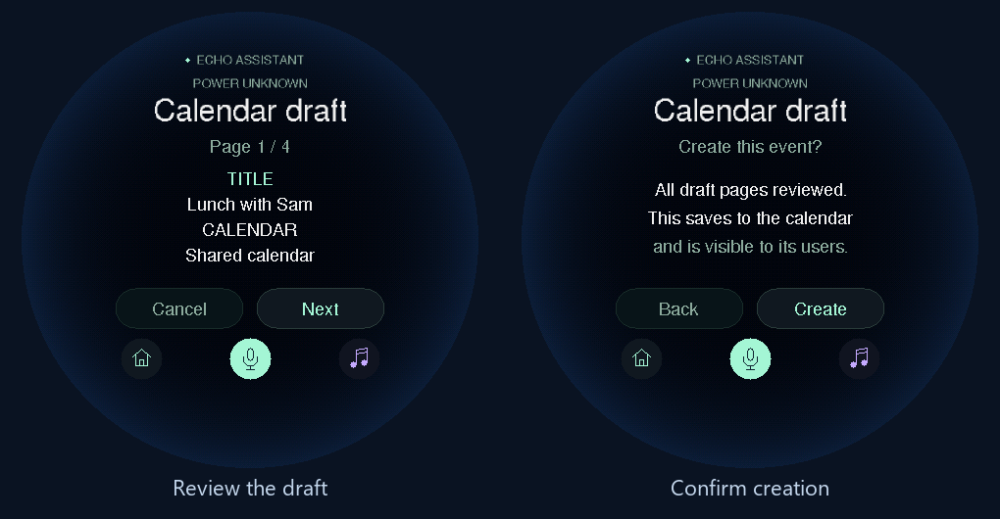

# Calendar review on Echo Mini

Describe an event to Echo, review its details on the round screen, then explicitly
press **Create**. This requires firmware **0.17.0** and the matching host software.
The host update is deployed and firmware builds and desktop rendering pass. Installation and physical touch
acceptance remain pending. Calendar creation also needs a supported Home Assistant
calendar and the owner's [event-creation grant](CALENDARS.md).

## Review and create

1. Say “Hey Echo” or press Talk, then describe the title, date, start and end time.
   Name the calendar if more than one is available.
2. Read the draft using **Next**, **Previous**, or horizontal swipes. The pages show
   the title, calendar name and identifier, dates, time zone, all-day status, repeat
   rule, location and notes. Timed events include UTC offsets; all-day events show
   the last included day. No calendar request is sent while browsing.
3. On the last page, press **Review done**. **Create** appears on a separate screen
   only after every page has been visited. Press it to send the event once, or
   **Back** to continue reviewing.
4. Echo distinguishes **accepted**, **rejected**, and **completion unconfirmed**.
   Accepted means Home Assistant accepted the request; check the agenda for the
   provider's final state. If completion is uncertain, check before trying again.

Press **Cancel** on the first page to discard an unsent draft. Home, Music or Talk,
microphone mute, another wake, an alarm, a call or connection loss also dismiss it.
Drafts expire after at most 15 minutes. Dismissing a request that has already been
sent cannot undo its calendar action. The result stays visible for 30 seconds.

The Mini's previously interrupted music stays paused while review is open, and
grouped audio stays locally held. Dismissal releases that hold; an explicit Pause
still prevents deferred Spotify resumption. Starting new playback dismisses review.
The physical upper button remains microphone mute, not a Create shortcut.

## When to use the Deck

The Mini has a bounded, printable-ASCII preview: at most 128 lines of 24 characters,
four lines per page. It never enables Create for truncated or substituted text,
unresolved questions, invalid dates, or an unavailable/unapproved calendar.
Such drafts direct you to **My day → New event** on the Deck, where you can prepare
and edit the event. This is guidance, not automatic transfer of the Mini's draft.
There is no Mini text editor or saved-draft inbox yet.

The voice extractor currently drafts single events. The preview also represents
bounded repeat rules if supplied by a compatible draft source. Series management
and invitations are outside this Mini flow. Personal accounts remain separate
work. [Guest Mini profiles](ROUND_ACCESS.md) disable calendar drafting; this flow
is available in Household mode.

## Connection and checks

Old firmware does not advertise `calendar_review=1`, so the host sends no new
calendar commands to it. The new protocol binds every row, acknowledgement and
confirmation to a fresh draft identifier. A checksum and row count prevent a partial
transfer from becoming a reviewable event. The host reuses the calendar API's live
permission checks and durable request receipts; it does not retry an uncertain
write automatically. Drafts stay in volatile memory and are not stored as recordings
or calendar history by this adapter.

Focused Python checks cover complete previews, expiry, permission rejection,
confirmation order, repeated messages and uncertain responses. A simulated voice
conversation checks draft delivery and music hold/dismissal without sound. Native
C++ checks exercise the actual firmware review state and render its screens with
the board fonts, including the widest supported text. See [package checks](PACKAGE_CHECKS.md).
These checks create no real calendar events and do not establish physical acceptance.
