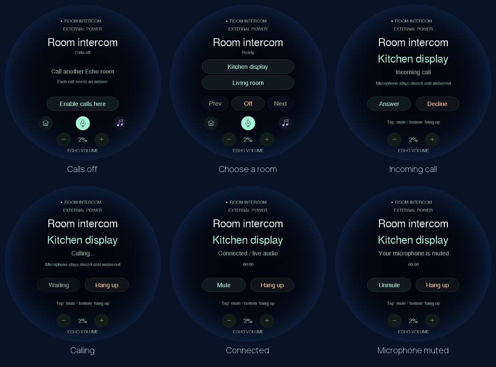

# Intercom on the round speaker

The round speaker can call a paired Echo display or answer an incoming room call.
It uses the same private host relay as [display intercom](ROOM_AUDIO.md).
This addition requires **round firmware 0.14.0** and the matching host adapter.
Software checks and firmware builds pass; installation on the physical round
board and a real call remain pending.

## Enable it deliberately

1. In the owner web workspace, assign rooms under **Settings → Room receivers**
   and enable **Allow calls** for both endpoints.
2. Install the firmware and host from this same source revision, following the
   [identity and backup checks](HARDWARE.md). Keep the original backup.
3. The round host needs the existing local echo-cancellation runtime described
   in [local setup](SETUP.md). Its microphone and output reference are processed
   together. If that runtime cannot start, the receiver stays unavailable.
4. On the round screen, open **Settings → Intercom**, or swipe to Intercom.
   Press **Enable calls here**. This opt-in resets when the board or its host
   connection restarts; it is not saved to flash.
5. On the paired display, open **Planner → Room audio → Intercom** and enable
   calls for that browser session.

Select an available room on the round speaker to call it. The other person must
press **Answer**. An incoming call likewise needs **Answer** on the round screen;
**Decline** dismisses it without call microphone audio being sent. Incoming-call
alerts are visual only, so setup does not introduce an unexpected ringtone.

## During a call

Both endpoints can speak. **Mute** stops the round microphone's call stream while
keeping incoming speech audible. **Unmute** requires a new capture acknowledgement
from the firmware before the host forwards more samples. **Hang up** clears the
audio buffers. On the call screen, the upper physical button toggles call mute
and the lower button hangs up. The volume buttons on screen still control the
round speaker's output; begin at **2%**.

The call screen stays visible until the call ends. Wake recognition and spoken
assistant commands pause during the call; call audio is never sent to STT or the
assistant. Music is paused and remains paused afterward. Alarm and announcement
delivery waits for the existing call to finish. Global software microphone mute
ends the call; call mute alone does not change the saved global mute preference.

## Transport and failure behavior

Calls use 16 kHz mono PCM through the authenticated host API. The existing paired
USB or TLS connection carries audio between the host and round board, including
the speaker reference used for local echo cancellation. Incoming PCM is converted
to the board's 48 kHz output. Call buffering is shorter than music buffering;
late packets are discarded rather than accumulating seconds of delay.

Consent is tied to one call identifier in both firmware and host memory. An
active status from the host alone cannot enable the call microphone. Room-picker
requests include a binding to the displayed room list. Stale choices are rejected.
Mute invalidates queued capture, and each new unmute requires the firmware's
acknowledgement. Host, capture, speaker or network failure stops the call. There
is no automatic call reconnection. Calls retain the relay's explicit answer,
quiet-hours, revocation, 30-second ringing and 15-minute duration limits.

No call recordings or transcripts are written. The host keeps only bounded PCM
queues in memory. The relay's optional empty keepalive frames let native clients
use a finite socket timeout even when both microphones are muted.

## Acceptance still required

Synthetic checks cover incoming/outgoing consent, stale room choices, capture
acknowledgements, mute/unmute, hang-up, network loss, bounded audio and framing.
The shared firmware renderer checks the circular layout and consent state.
These checks do not establish acoustic echo cancellation, latency or audibility.
Confirm both directions, quiet volume, feedback behavior, physical buttons and
disconnect cleanup on the actual round speaker and Pi after their audio hardware
is connected. Keep the new receiver off until that checkout.
