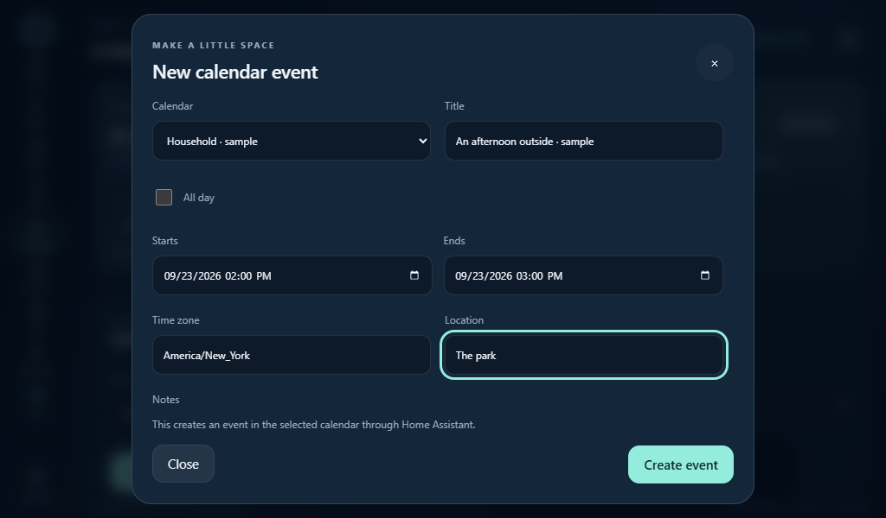
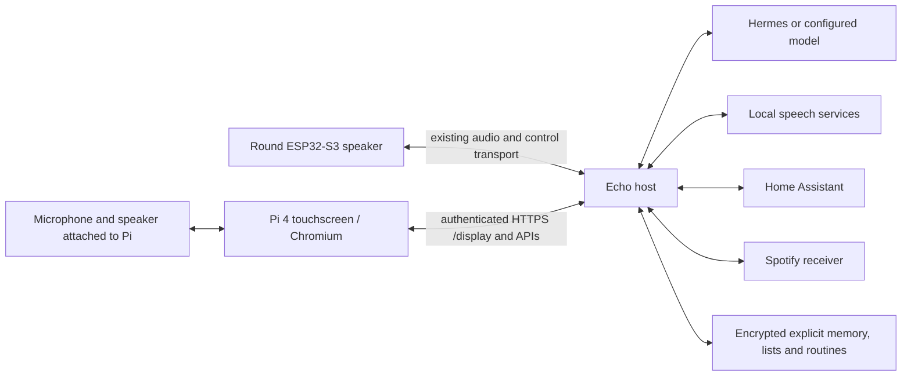
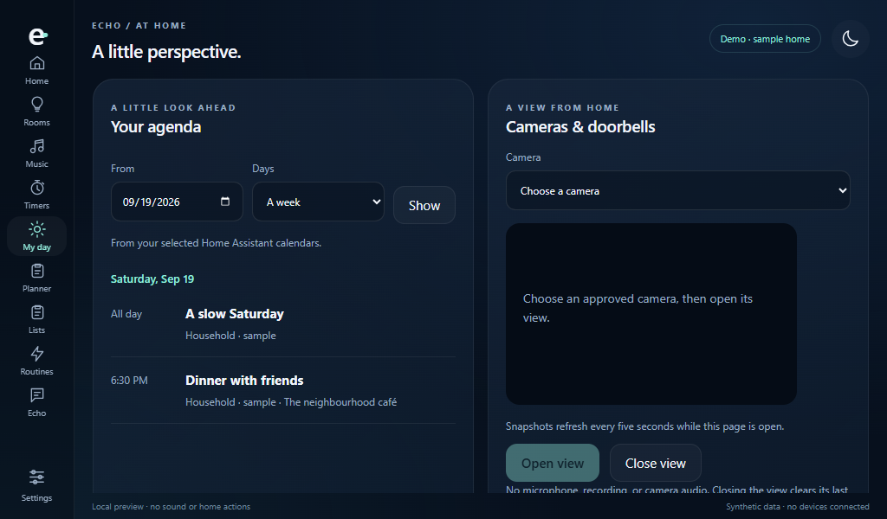

# Echo smart display

Echo is growing into two builds with one assistant: the compact round AMOLED
smart speaker and a larger Raspberry Pi touchscreen for a bedside table, kitchen,
or desk. The larger build takes inspiration from Nest Hub and Echo Show: useful
at a glance, comfortable to touch, and able to answer or act when asked.

The repository is private during this work. The next public package should
include both complete builds, their assembly guides, and their verified limits.
Private installation data remains outside Git even while the repository is private.

## Try the first implementation

The `/display` page is included in Echo's existing web server. Open **Smart
display** from the web workspace, or run the existing launcher with `--display`:

```powershell
.venv/Scripts/python.exe tools/open_ui.py --display
```

For a completely separate, interactive demonstration:

```powershell
.venv/Scripts/python.exe tools/preview_smart_display.py
```

Open **http://127.0.0.1:8788/display**. The demo uses synthetic room names and
in-memory state. List edits, timers, and simulated controls work, but no home
devices, models, credentials, microphone, or speaker are connected. Closing the
preview server clears its data. Workspace links explain their live counterpart.


See [Music on the smart display](MUSIC_DISPLAY.md) for controls, audio destinations,
receiver upgrades and the limits of Spotify library browsing and casting.




The [daily briefing and calendar guide](DAILY_BRIEFING.md) explains source selection,
separate event-creation permission, time zones and uncertain calendar responses.

The initial layout targets **1024 × 600 landscape**, with responsive layouts for
larger displays and phones. Its blue background, luminous ring, mint accents,
and listening states share the round device's visual identity. Software dimming
and reduced-motion support are included; software dimming does not switch off
an LCD backlight.

The [display design guide](DISPLAY_DESIGN.md) covers the bundled typeface,
smooth status ring, touch sizing and native-resolution kiosk configuration.

## One assistant, independent devices



The Pi is a smart display with its **own microphone and speaker**. It does not
need the round speaker for voice. The host runs the assistant, speech models,
integrations and shared storage. Pi push-to-talk uses its own endpoint identity,
and its spoken reply returns only to that display.

The home and Echo rings show this display's capture, processing and reply state.
Another device being offline does not put the Pi into an offline voice state.
Text entry works without a microphone. Native Pi wake words, reply playback and alarm chimes are implemented; physical audio acceptance remains open.
The round speaker retains its separate voice path and existing Spotify receiver.

[Build options](BUILD_OPTIONS.md) explains the Pi, round-speaker, browser/phone
and future adapter choices. Audio must be explicitly assigned to an endpoint;
a missing microphone must not silently redirect listening to another room.

## Implemented software

These features are implemented in the private development branch. Hardware and
live-account acceptance are tracked separately in [the build queue](BUILD_QUEUE.md).

| Page | What works | Boundaries |
| --- | --- | --- |
| Home | Clock, date, weather, named rooms, next timer, live voice status | Voice status reflects this display; the round speaker is optional |
| Rooms | Room lights, individual brightness/colour/white temperature, thermostat mode and temperature range, speaker selection and supported playback actions | Existing Home Assistant permission grants and fresh state are required; choosing a device does not act on it |
| Music | Spotify cover art, title/artist/album, seek bar, previous/play/pause/next, shuffle, repeat and input level; home-speaker selection; saved HTTPS radio presets and local files | Spotify can use the separately configured Pi receiver or the explicitly selected round speaker; physical Pi playback acceptance remains open. Library, playlists and queue browsing open Spotify. Chromecast/AirPlay receivers are not installed. Radio and local files play through the display's output |
| My day | Local daily briefing; selected calendars; timed/all-day event creation with separate write grants; selected camera streams/snapshots; silent doorbell cards | Creation requires a compatible calendar and owner permission. Live MJPEG depends on the camera integration. No recording or camera audio |
| Timers | Multiple persisted timers and a quick one-off alarm | Delivery still needs a connected audio endpoint |
| Planner | Recurring alarms/reminders, daily/weekday/custom repeat, IANA zones, snooze, dismiss, missed events, quiet hours | Spring gaps use the first valid minute; autumn duplicates ring once. Events over 15 minutes late remain visible without sounding |
| Lists | Shopping, to-do, notes, edit/reorder/complete/delete, encrypted persistence | Explicit text/voice commands such as “Add coffee to my shopping list” are supported; ambiguous deletes ask for clarification |
| Notifications & room audio | Persisted household notes; room-targeted announcements and delivery receipts | [Room receivers](ROOM_AUDIO.md) are opt-in, respect quiet hours and expire queued messages after five minutes. Answered two-way intercom is implemented between paired displays; the round adapter and physical audio acceptance remain pending. |
| Routines | Review and run saved routines | Existing device grants and action checks apply |
| Echo | Existing conversation, web research, memory and cited sources; explicit home-control opt-in; server-side Stop | Push-to-talk records up to eight seconds and returns speech to this display; native Pi wake is opt-in; audio hardware acceptance remains open |
| Settings | Display preferences, encrypted shared photo album, camera/calendar selection, radio presets, display pairing and revocation | Only the owner can change sources, upload/remove shared photos, manage radios or pair displays |




### Pairing and privacy

The owner creates a five-minute, one-use pairing code in Display → Settings.
Enrollment creates an individually revocable display credential. The host stores
only its hash; the Pi stores the restricted credential in a private file outside
Git. The Pi's loopback bridge keeps it out of Chromium and signs each upstream
request. This path does not depend on an eight-hour browser cookie. Direct
browser sessions can still expire and require signing in again.

A paired display can use household features but cannot read provider keys, edit
access policy, discover unselected calendar/camera sources, or enroll another
display. Revocation is checked on every request. Camera permissions are checked
again after fetching a frame. Snapshots and authenticated responses are not cached.

Calendar and camera selection is opt-in and currently shared across paired
displays. Per-user private calendars and per-room source policies remain future
work. Calendars already connected in Home Assistant can be selected; this build
does not ask for new Google or Microsoft credentials. Camera requests stay on
the configured Home Assistant origin and never forward its token to redirects.

Lists, schedule state, device credential hashes, selected sources, radio presets,
and shared photos are encrypted with Echo's host storage protector. Revisions
protect edits from overwriting another screen's changes. Unreadable data is
preserved and reported, and writes use atomic replacement.

Shared photos are limited to 60. Each upload must be a valid JPEG, PNG or WebP
under 12 MB and 32 megapixels. Echo normalizes orientation, removes metadata,
resizes to fit 1920 pixels and encrypts the resulting JPEG. Original filenames,
EXIF and location tags are not retained. The small settings recovery archive
includes new settings documents but **does not include the photo files**. Include
`local/display-photos` in a private host backup along with the host encryption key.

Browser local storage contains only display preferences. Session-only photos and
media remain an option; clearing them releases their local object URLs. Shared
photo removal affects all paired displays. Removing a radio preset does not revoke
a stream already opened directly in a browser; press Stop to end playback.

### Still ahead

Push-to-talk capture, request cancellation and reply routing are implemented.
Native Pi wake and request interruption are implemented; physical echo-control acceptance is still required. Further integrations include calendar event editing and natural-language drafting,
grouped audio, round-endpoint intercom, external calling,
and household/guest profiles. These are not working features yet. Commercial
video and proprietary casting depend on supported providers and licensing.

## Pi hardware and bring-up

Recommended baseline: Raspberry Pi 4B with at least 4 GB RAM, a supported
touchscreen, reliable storage, a suitable **5.1 V / 3 A Pi supply**, and cooling.
Use the display's specified supply when required. A dock USB connection does not
automatically expose the Pi's SD card as a disk, and may not supply adequate power.

Identify the actual panel before ordering parts or choosing a driver. Earlier
art-frame deployment notes describe a 1024 × 600 HDMI display; a separately
planned 10.1-inch DSI panel is not proof of the installed panel's model or size.
Check the label, video cable, touch USB connection, connector state, resolution,
rotation, and touch mapping. Pi audio needs a real capture device: the Pi 4 has
no built-in microphone, and HDMI/headphone outputs do not provide one.

1. Complete and verify the original whole-card backup, including partition table,
   boot files, and Linux root filesystem. Store the image separately from the Pi.
2. Either reuse the existing card after its owner approves repurposing, or choose
   a **new 32 GB or larger card** to keep the original as an immediate rollback.
   A supported OS with Chromium can be converted in place; a reflash is not
   required just to change kiosks. Small cards should hold only the display client,
   with models and media on the Echo host. Larger storage is recommended for
   browser updates and media; it is not required to start the display client.
3. Confirm stable power with no current undervoltage, then detect video, touch,
   networking, and audio. Do not disable the hardware watchdog to hide instability.
4. Start with the existing desktop and Chromium. Use the launcher preflight:

   ```bash
   python3 deploy/pi/kiosk.py --check
   ```

5. In a signed-in owner workspace, open Smart display → Settings → Your displays.
   Create a code for the Pi, then run on the Pi as its desktop user:

   ```bash
   python3 deploy/pi/connect.py --url https://YOUR_ECHO_HOST/display
   ```

   Enter the code at the hidden prompt. Use a valid trusted HTTPS certificate;
   loopback HTTP is accepted for a local forward. Do not put credentials in URLs.
6. Check and install the display bundle as that same user, without sudo:

   ```bash
   python3 deploy/pi/setup.py --check
   python3 deploy/pi/setup.py --install
   ```

   Installation copies a versioned client bundle, starts a user systemd loopback
   bridge, and adds an Echo desktop autostart entry. It does not reflash the card,
   install packages, enable OS auto-login, change audio, or retire another kiosk.
   Deliberately stop the old kiosk before launching Echo; do not run two kiosks.
7. From the existing desktop, open Echo now with:

   ```bash
   python3 ~/.local/share/echo-display/runner.py kiosk
   ```

   It uses a separate private Chromium profile and preserves TLS and sandbox
   checks. If the host is offline, the display reports it and continues retrying.
   If its access was revoked, create a new code and use `connect.py --replace`.

   **Display connected** means the screen can reach the authenticated Echo API.
   The round speaker has its own connection: **Round speaker offline** on the
   music page does not mean the Pi is offline. Spotify currently plays through
   that speaker, so check its power and Wi-Fi. Text chat and home controls remain
   available on a connected display. **Host unreachable · retrying** reports a
   server connection failure; **Pairing / sign-in needed** reports expired or
   revoked access. Both recover automatically when access is restored.
8. To switch back after a client update:

   ```bash
   python3 deploy/pi/setup.py --rollback
   ```

   This selects the previous client bundle and restarts its bridge. Close and
   reopen the kiosk or log out and in. Pairing and browser data remain intact.
   `--remove-autostart` stops/removes only Echo-managed startup entries and keeps
   installed bundles and data. It does not restore an SD image or modify the old
   art-frame project. Existing unowned startup files are not overwritten.

The bundle installer and rollback have been tested with temporary directories
and a simulated loopback bridge. The first Pi installation now runs through its
existing X11 kiosk service and returns automatically after an OS restart. The
owner confirmed the interface looks right. A full power-off cold boot, extended
network interruption and complete touch calibration remain acceptance steps.

### Reusing a dedicated X11 kiosk

Some existing Pi builds start X directly from a system service and do not run a
full desktop. In that case an XDG autostart entry alone will not open Echo. Keep
the original service and script, then use a separate service override to select
Echo's session entry. Pair and install the bundle first, as the normal kiosk user:

```bash
install -m 0700 deploy/pi/x11-session.sh "$HOME/.local/share/echo-display/session.sh"
sudo loginctl enable-linger "$USER"
```

User lingering starts the restricted loopback bridge independently of an SSH
login. The existing kiosk service's override should keep its original `User`,
display and restart settings, clear its old `ExecStart`, and start X with the new
session script. Replace `YOUR_USER` with that existing desktop account:

```ini
# Managed by Echo display setup
[Unit]
Description=Echo smart display kiosk
After=network-online.target tailscaled.service

[Service]
ExecStart=
ExecStart=/usr/bin/startx /home/YOUR_USER/.local/share/echo-display/session.sh --
```

Store this in a distinct `echo-display.conf` drop-in for the existing kiosk
service, then reload systemd and restart that service. Stop an old audio
satellite separately if it would compete for capture or playback. Record each
service's previous enabled state privately before changing it.

For rollback, remove only the Echo-marked drop-in, reload systemd, and restart
the original kiosk service. Restore previous audio-service states from that
record. Remove Echo autostart with `setup.py --remove-autostart` when returning
to the old project. Neither path needs to overwrite the verified SD image.
The bridge presents an automatically retrying page if the private network or
host is not yet available at boot.

The first release should offer both a reusable audio endpoint and a Pi with its
own USB microphone/speaker path. Choose an audio device with known Linux support
and a practical echo-cancellation path. Verify capture, playback, physical mute,
and speaker feedback independently before introducing wake-word tests.

## Build order and completion criteria

| Stage | Deliverable | Acceptance before moving on |
| --- | --- | --- |
| 0 · Preserve | Full original-card image and restore instructions | Exact card length, source/image SHA-256, gzip integrity, read-only filesystem check; owner approval before reusing the card. A spare-card boot rehearsal remains recommended and must be reported separately |
| 1 · Shared display | This UI, real API connections, encrypted lists, safe demo | Desktop and 1024 × 600 flows, authentication, disconnected state, no automatic actuation, physical touch acceptance |
| 2 · Pi appliance | Stable OS/card, HTTPS access, per-device pairing, kiosk startup | Cold boot, network loss/recovery, credential revocation, original build rollback |
| 3 · Pi voice | Capture/playback adapter, wake pipeline, AEC, routing, mute | Quiet wake/reply, interruption, DND, no feedback wake loops, endpoint isolation and recovery |
| 4 · Daily usefulness | Recurring alarms/reminders, list tools, richer home/music controls, agenda | Correct timezone/DST and permissions, failed-action reporting, persistence and delete behavior |
| 5 · Household experiences | Doorbell/camera, announcements, photo albums, optional calls | Private routing, explicit consent, supported codecs/services and usable fallback states |
| 6 · Complete package | Both builds, enclosure/BOM, installer, screenshots, migration and recovery guide | Physical acceptance of both builds, private-data audit, clean-machine install, rollback, user-approved public release |

For each stage, test the behavior that could fail: authorization, persistence,
device routing, recovery, or hardware operation. Use synthetic data for screenshots
and software checks. Sound and real home-device tests are separate, intentional
acceptance steps. A rendered card or accepted HTTP request does not prove a
microphone, speaker, light, or thermostat actually worked.

### Current verification

The current software passes 79 focused tests across schedules/DST, list commands,
photo privacy/persistence, display credentials, selected sources, simulated camera
responses, home action validation, routines, timer delivery, and Pi bundle/bridge
behavior, and the private HTTPS gateway’s owner/display separation. Browser checks cover recurring schedules, silent notifications, list
editing, agenda, source selection, album upload/delete, and a 390-pixel phone
layout. They use a separate synthetic preview and make no real home-device calls,
recordings, playback or external stream requests. JavaScript syntax and the source
publication guard also pass.

The original Pi card has a separate verified full-card backup. With the owner's
authorization, the existing OS was converted in place: no partitioning or
formatting. Original kiosk files remain available for rollback. The reviewed
backend features are deployed on the existing host with private settings and
identity modules preserved. The Pi is paired through the private HTTPS gateway
with the restricted `display` role. Its household requests succeed; owner
settings and display administration return HTTP 403.

The Pi runs at 1024 × 600 over HDMI with USB touch, Wi-Fi and healthy power.
The owner confirmed the appearance, and the kiosk and authenticated bridge
recovered after an OS restart. A local reconnecting page handles host/network
startup before the main app loads. Microphone hardware is not detected, so
physical capture, reply audio and wake-word acceptance remain open. The repo
stays private; version `0.27.0.dev1` is an internal build, not a public release.

### The conversation workspace

Echo's blue-green ring is now the project icon, favicon and display navigation
mark. The Echo page puts its status panel at top left, voice settings below,
and the conversation alongside them. Typed and spoken messages share one
scrolling conversation; the composer includes microphone, send and stop controls.
The ring shows capture, processing and reply states. Messages remain visible in
the browser tab during navigation and clear on reload; this view does not add a
new persistent transcript store. Home-action receipts remain attached to replies.


### Speech from the Pi

Open **Echo → Start talking** to grant microphone access to this display. Finish
and send the recording, or cancel to discard it. Capture stops automatically at
eight seconds; all microphone tracks close before processing starts. Opening a
different page cancels capture. The Pi sends mono PCM over its authenticated
bridge; local Whisper on the host transcribes it, the configured agent answers,
and the host returns a WAV reply only to the requesting display. This requires
the host's Whisper runtime and selected speech model. The round speaker's wake
path stays independent.

Reply volume starts at **2%**. If the browser prevents playback, press Play on
the returned audio control. A request can still return its text answer when
speech generation fails. Home actions are off unless explicitly enabled for
that request, and existing device permissions still apply. Stop requests cancel
host processing; completed action receipts remain visible. An uncertain stop
is reported as uncertain rather than inviting an automatic retry.

The microphone audio stays in memory and is not saved. Transcribed text follows
normal Echo conversation and explicit-memory behavior. Browser noise suppression
and echo cancellation are requested, but actual hardware performance is unverified.
The browser path uses push-to-talk. The optional [native Pi listener](PI_VOICE.md) adds local wake words and attached ALSA audio.

For a named ALSA device, the installed bundle also includes a manual adapter:

```bash
python3 deploy/pi/audio_once.py --check
python3 deploy/pi/audio_once.py --once --capture-device YOUR_INPUT --playback-device YOUR_OUTPUT --volume 2
```

The check only lists hardware. `--once` intentionally records and plays a single
reply, so run it only when ready for a quiet physical test. It uses the same
paired loopback bridge, keeps recordings in memory, and is never autostarted.

### Cameras and doorbells

Live MJPEG views and encrypted doorbell activity are implemented, with opt-in
source selection, silent cards and explicit camera opening. See the
[camera and doorbell setup guide](CAMERAS_AND_DOORBELLS.md) for supported triggers,
stream limits and remaining physical acceptance.

### Pi alarm sound

[Pi alerts](PI_ALERTS.md) adds a native chime worker with per-display timer and
reminder routing, quiet hours, and visible snooze/dismiss controls. It is disabled
until the attached speaker is selected in Settings.
