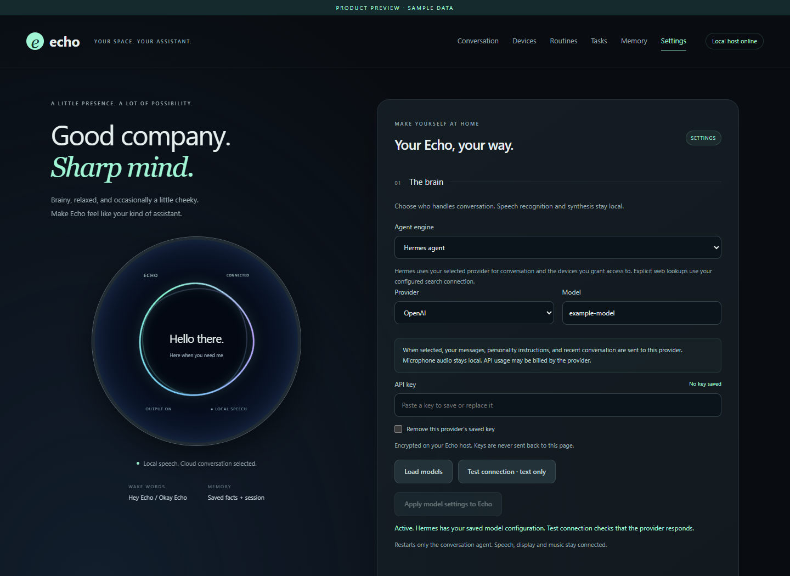
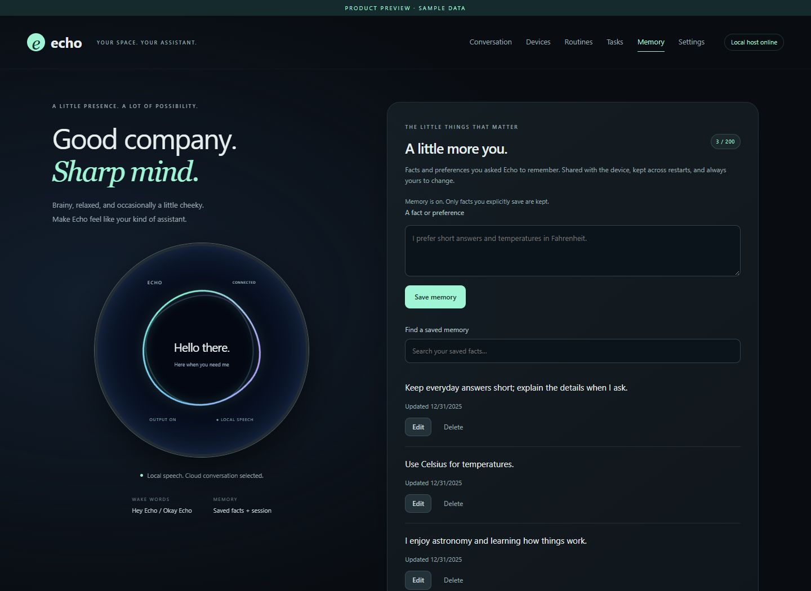
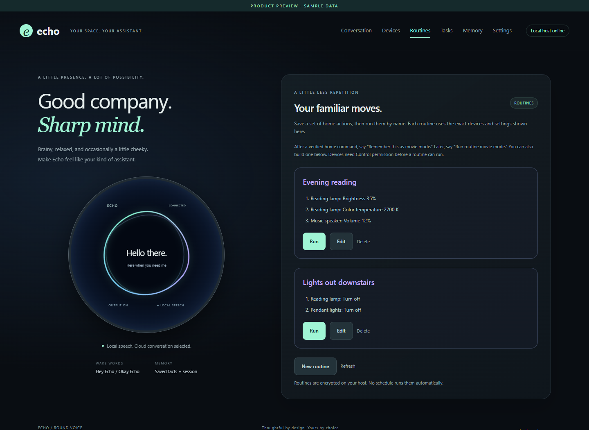
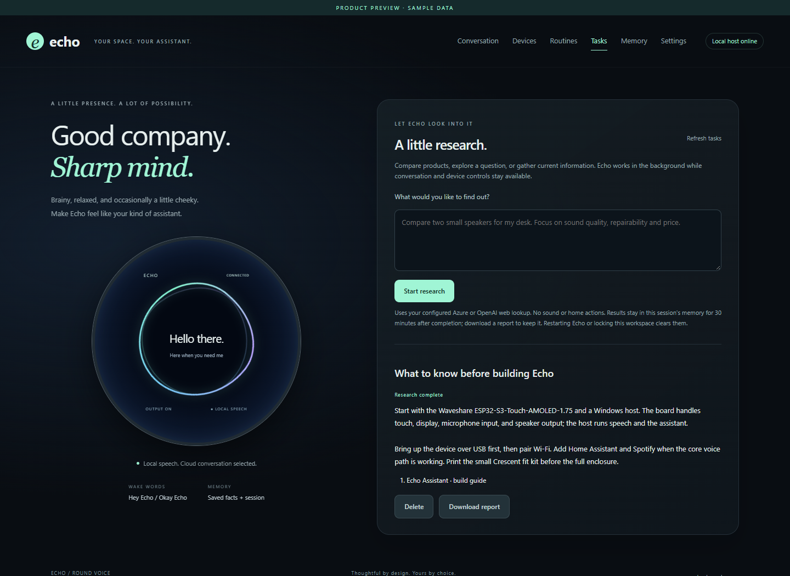

# The Echo web app

The browser workspace complements the round display. Use it for text
conversation, home-device permissions, saved memories, routines, research, and
provider/voice settings. In a real installation, open it through `Open Echo.cmd`
or `tools/open_ui.py` to receive an authenticated sign-in link.

The images on this page show the actual application with **sample data**. They
contain no live accounts, saved credentials, home inventory, or conversations.

## Conversation

Text chat stays silent. Request web sources for an answer, or allow home actions
for a particular message. Active work can be stopped, and home-action receipts
distinguish confirmed results from unconfirmed ones.

## Devices

See room-light controls, search/filter the inventory, assign rooms for Echo, and
choose Read state, Control, or Hidden for individual devices. Home Assistant
provides the inventory and capabilities. See [home setup](HOME_CONTROL.md).

## Settings

Select a provider/model and direct or Hermes runtime, then edit the personality,
reply budget, speech engine, voice, and memory/lookup preferences. Keys are entered
into the real installation's protected settings, never into the preview.

## Memory

Review facts that were explicitly saved, search them, edit or delete individual
items, and export or clear the collection. Pausing memory retains the collection
while stopping its use in conversation.

## Routines

Save a named sequence of device settings and run it on demand. The steps show
their exact targets; execution requires available devices with Control access.
Saving a routine does not run it or create a schedule.

## Research tasks

Start a longer lookup, follow its status, and return to a report with sources.
Completed reports can be downloaded. The sample below is written fixture text,
not a model-generated result or a live search.

## Explore and refresh screenshots

From a checkout, run `python tools/preview_web.py`, then visit
`http://127.0.0.1:8778/`. Only Python's standard library is required. The server
binds to loopback, supplies fixed read-only fixtures, and rejects API writes.
It does not import the runtime backend or read anything from `local/`.

The six pages are `/`, `/devices`, `/settings`, `/memory`, `/routines`, and `/tasks`.
They use the production `web/index.html`, `web/style.css`, and `web/app.js`.
A visible sample-data banner distinguishes the preview from a connected device.

For consistent captures, use a 1440 × 1050 browser viewport. Capture each page
after its sample data has loaded. README detail images capture the relevant
panel or fieldset; they do not rearrange the app or add fictional controls.
Keep temporary browser artifacts outside Git. Strip image metadata and inspect
the captures before adding them to `docs/images`. Stop the preview with Ctrl+C.

The optional [alternate Hermes WebUI](DEPLOYMENT.md#browser-access-and-storage)
is a separate view of the same agent; these screenshots show Echo's own workspace.
