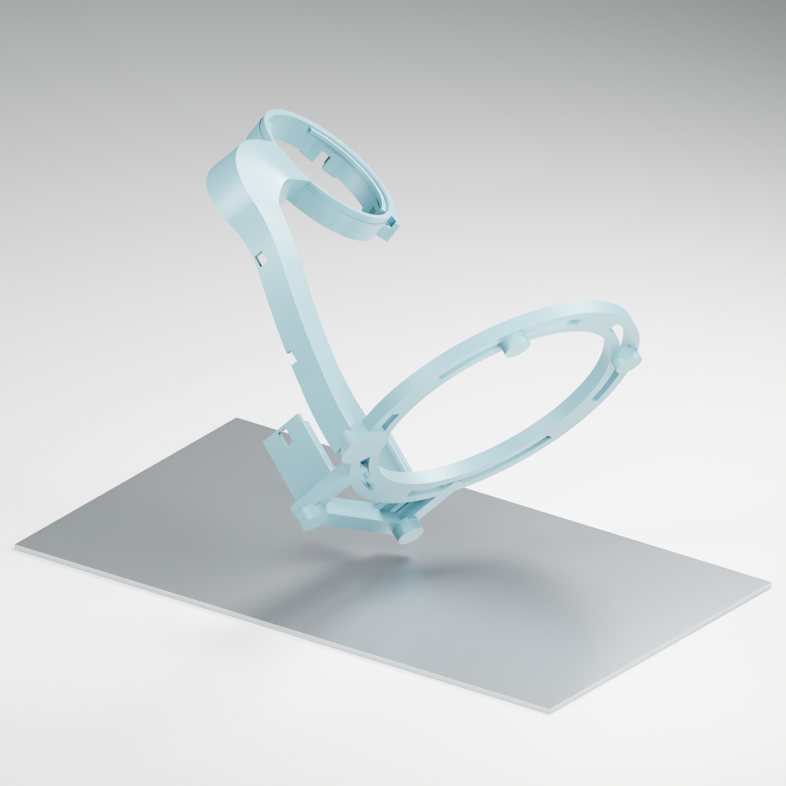

# Crescent v1 · M7 print and assembly guide

Prepared 17 September 2026 for the Waveshare ESP32-S3-Touch-AMOLED-1.75, a salvaged Google Home Mini speaker module, and CS-MSX200SL battery. This is the USB-aligned Crescent concept developed into printable solids. Physical assembly and cured-resin fit remain unverified.

**Start with the small fit kit. These are STL models; add supports and slice for the Photon Mono M7 before printing. No supports, rafts, exposure settings, or sliced printer job are included.**

## Files and quantities

Use `M7-oriented/` for the suggested tilted orientations, or `STL/` to choose your own orientation. Both folders contain the same parts. Import from only one folder. Units are **millimetres**, scale **100%**. Each STL contains one part; duplicate it to the quantity below. Optional parts and gauges are separate from the full assembly.

| File prefix | Part | Full assembly quantity | Resin per part |
| --- | --- | ---: | ---: |
| 01 | Main stand, arm, display carrier and battery cradle | 1 | 33.64 mL |
| 02 | Screen snap ring | 1 | 1.28 mL |
| 03 | Button plunger | 2 | 0.14 mL |
| 04 | Button rear keeper | 2 | 0.25 mL |
| 05 | Adjustable speaker arm | 4 | 1.07 mL |
| 06 | Speaker post with 2.4 mm locating pin | 4 | 0.53 mL |
| 07 | Alternative 2.0 mm locating pin | Replace 06 if needed | 0.52 mL |
| 08 | Optional 4 mm spacer under speaker post | Up to 4 | 0.25 mL |
| 09 | Separate display and USB pocket fit test | 1 test piece | 7.60 mL |
| GAUGE | Optional entry gauges: 49.8, 50.2, 50.6 mm | As needed | About 1.06 mL |

**Full assembly: 42.08 mL of solid model volume**, excluding supports, rafts, optional parts and test pieces. Main stand envelope is approximately 118.3 × 125.0 × 138.7 mm. Open sections keep the frame light; arm walls are principally 1.8 mm, with reinforcement at the root. Do not automatically hollow these parts again.

## 1. Print the fit kit first

Print **09 × 1, 02 × 1, 03 × 2, and 04 × 2**. This is about **9.66 mL** before supports. It reproduces the actual display carrier, upper arm pocket, ring and button guides. If it passes, the ring, plungers and keepers can be reused in the full stand.

Wash, fully cure and remove support marks before checking fit. Use the same resin, exposure profile and cure process you intend to use for the stand. The production entry bore is 50.2 mm around the manufacturer's 48.96 mm glass. The gauges are optional; keep each gauge labelled with its filename because the diameters are not embossed on the parts.

Check that the board drops onto the seat without force, your actual USB plug can enter and leave the pocket, both buttons move freely and return when released, and the ring can latch and release gently. Standard resin varies in brittleness and shrinkage. The ring uses long fingers with small deflection, but its behavior has not been physically tested in your resin. Stop if a finger cracks or the ring needs force; do not use the screen glass to force a fit. Do not scale the entire assembly to correct one local fit.

## 2. Support and slice for the M7

The suggested main orientation occupies approximately **152.9 × 114.3 mm** on the M7's **223.64 × 126.48 mm** plate, with a model height of **143.0 mm**. Its lowest point is raised 4 mm for supports; the top is about 147.0 mm above the plate. All other oriented files are also raised 4 mm. A slicer may automatically drop imported objects, so restore clearance above the plate when adding supports.

1. Select the **Photon Mono M7** and a resin profile calibrated for your printer and material. Use the layer height and exposure from that profile; no new exposure values have been assumed here.
2. Import the needed parts from `M7-oriented/`. Leave the main stand on its own plate if support rafts or smaller parts would crowd it. The provided files are individually oriented, not an arranged plate project.
3. Anchor the lowest base/foot surfaces and arm root with adequate supports. Add supports at newly appearing islands along the base, rear arm edges, battery rails and display carrier. Support the outer/rear surfaces of the ring and small parts without damaging their mating features.
4. Keep support tips away from the glass seat, entry bore, button sliding surfaces, snap beads, thin finger tips, locating pins and nut pockets. Use light, accessible contacts on small features and stronger anchors on the stand's lower structural surfaces.
5. Inspect the layer preview for islands, unsupported channel edges and temporary resin cups. Confirm that supports and rafts stay inside the build plate. The main model leaves about 6 mm per side along the plate's narrow dimension before support spread.
6. Slice and export using the M7 printer profile. The STL files cannot be sent directly as a printer job.

The structure is already open for washing and drainage. Inspect the underside of ledges, nut pockets and arm channel during cleanup. Smooth support scars without enlarging functional surfaces unintentionally.

## 3. Fasteners and consumables

| Item | Quantity | Purpose |
| --- | ---: | --- |
| M2 × 8 mm machine screws | 4 | Two rear-keeper screws per button |
| M2 hex nuts | 4 | Captive nuts in button guides |
| M3 × 12 mm machine screws | 4 | Speaker arms to slotted base |
| M3 × 8 mm machine screws | 4 | Speaker posts to adjustable arms |
| M3 hex nuts | 8 | Four arm clamps, four captive post nuts |
| M3 flat washers | 12 | Each side of arm/base clamps, plus under post screw heads |
| 2.5 mm nylon ties or suitable soft straps | As needed | Rear cable routing and battery restraint |
| Thin compliant gasket/tape, approximately 0.2–0.3 mm | Small strips | Cushion the inactive display rim on its seat |

If using the 4 mm speaker spacers, replace the four M3 × 8 post screws with M3 × 12. These lengths assume ordinary thin washers and standard nuts; check actual engagement and protrusion while assembling. Tighten by hand only until secure. The nuts provide the threads; do not self-tap the resin.

## 4. Fit the display and buttons

1. Place the four M2 nuts into the guide pockets. A tiny piece of removable tape can hold them during assembly. Keep adhesive out of the sliding channels.
2. Place thin compliant strips only on the two glass-support arcs. Keep the top and bottom display-tab reliefs and left USB notch clear. The ledge is 0.25 mm below the CAD glass underside; the cushion takes up this clearance without rigid pressure on the glass.
3. With **USB on the left and buttons on the right when viewed from the front**, lower the board through the front opening onto the ledges. The rear is open. Do this before installing the button plungers or snap ring.
4. Load each plunger into its guide from the rear, narrow stem inward and broad button cap outward. Fit its rear keeper with the raised rail facing the plunger, then install two M2 screws from the rear into the captive nuts. Test free movement and return before fitting the ring. Total available plunger travel is approximately 0.9 mm; the board's switch provides the return force.
5. Align the ring as shown in the assembly preview, with its thumbnail notch toward the lower right. Its three catches engage the carrier's external groove. Gently seat one catch at a time. The ring overlaps only the inactive glass rim; its 45.6 mm clear aperture exceeds the 44.16 mm viewable diameter.
6. Release at the thumbnail notch and lift one catch gently at a time when servicing. Avoid pulling against the glass. Confirm that no gasket, wire or support scar preloads the buttons or blocks an actual microphone opening.

## 5. Fit the speaker

Use the **separate speaker module and its original acoustic housing**, not the full Google Home Mini electronics assembly. The adjustable posts accommodate different mounting positions; check your module before printing the full stand.

1. Loosely attach four adjustable arms to the curved base slots using M3 × 12 screws, washers above and below, and nuts underneath. Each arm can pivot around its clamp screw as well as move around the base slot.
2. Insert an M3 nut through the side opening of each speaker post. Attach the post through the arm's long slot using an M3 × 8 screw and washer from below. The optional spacer goes between the arm and post, with the longer screw specified above.
3. Set the speaker's mounting holes onto the pins. Move the arms and posts to match the actual hole pattern, then gently tighten. Use the 2.0 mm pin alternative if 2.4 mm is too large. Pins are tapered locating features, not press fits. The wider post shoulders carry the mounting lugs.
4. Check clearance under the housing and around the cone. Add the spacers if the housing needs extra height. Route the speaker wire into the rear arm channel without touching the cone. Add a removable soft restraint around suitable rigid housing features if the assembly must stay captive when lifted or carried; the pins alone allow the speaker to lift off.

**Speaker fit remains provisional:** public specifications give a 98 mm complete Home Mini and 40 mm driver, not the loose black module's dimensions or hole coordinates. The earlier visual study used an estimated 86 mm housing and 24 mm depth. The adjustable mounts avoid committing to guessed fixed hole centers, but the actual housing, lug thickness, clearance and stability still need a dry fit. Keep the original acoustic enclosure intact; this open stand does not supply a sealed speaker chamber.

## 6. Fit the battery and route cables

The upright cradle has a **52.8 × 13.2 mm clear footprint** for the specified **51.816 × 29.972 × 12.192 mm** battery. Slide the battery between the rails without force, orient its contacts for access through the open side, and secure it with a soft restraint through the rail slots. The holder leaves most of the battery exposed for prototype access.

The USB socket meets the arm on the left. The checked straight-plug envelope is **16 mm long × 10 mm wide × 7 mm thick** behind the socket. The actual cable moulding and bend radius must pass the fit-kit check. Tuck USB, battery and speaker leads into the rear channel and use the tie slots for strain relief. Leave enough slack at the PCB socket, keep acoustic ports clear, and check that a button press or cable tug does not tip the assembled stand.

The battery's contact adapter, wiring, charging connection and speaker amplifier are separate electrical work; the print provides their mechanical mounting and cable route only.

## Verification and source

All 12 STL files were exported and reloaded: each is watertight, consistently wound, one connected solid and has positive volume. Suggested orientations were checked against the M7 build envelope. Carrier, ring, button/keeper and arm/plug clearances were checked digitally. The manufacturer's STEP contains 666 solids; 31 conservative boundary candidates were checked against the enclosure, with no skipped conversions or detected static interference. A front-loading path was sampled every 0.5 mm over 12.5 mm, and the USB plug path was checked at four positions. Button contact was checked geometrically at rest and pressed positions.

See `verification.json`, `parts-manifest.json` and `M7-orientation.json` for details. These checks establish mesh validity and sampled CAD clearance; they do not establish physical resin strength, switch force, acoustic performance or final hardware fit.

The preview images show the exported print geometry. Teal and copper distinguish printed parts; choose any resin colour. The board in the close-up and the metal screw heads are references, not printable parts. The M7 plate preview deliberately shows the orientation without supports.

The `source/` directory contains the reproducible geometry generator and verification scripts. `STL/` and `M7-oriented/` are the files intended for your slicer. No supports, slicer project, firmware, or electrical components are included in these models.

- Manufacturer geometry: `ESP32-S3-Touch-AMOLED-1_75.stp` and accompanying drawing from the [Waveshare documentation](https://docs.waveshare.com/ESP32-S3-Touch-AMOLED-1.75). Download separately for CAD verification.
- Battery dimensions: CS-MSX200SL design dimensions, converted from inches.
- [Google Home and Nest specifications](https://support.google.com/googlenest/answer/7072284?hl=en).
- [iFixit Google Home Mini teardown](https://www.ifixit.com/Teardown/Google+Home+Mini+Teardown/102264), separate speaker assembly and four fasteners. No measured hole coordinates were taken from the photograph.

Reference documents were treated as dimensional evidence, not as instructions overriding the requested design.
