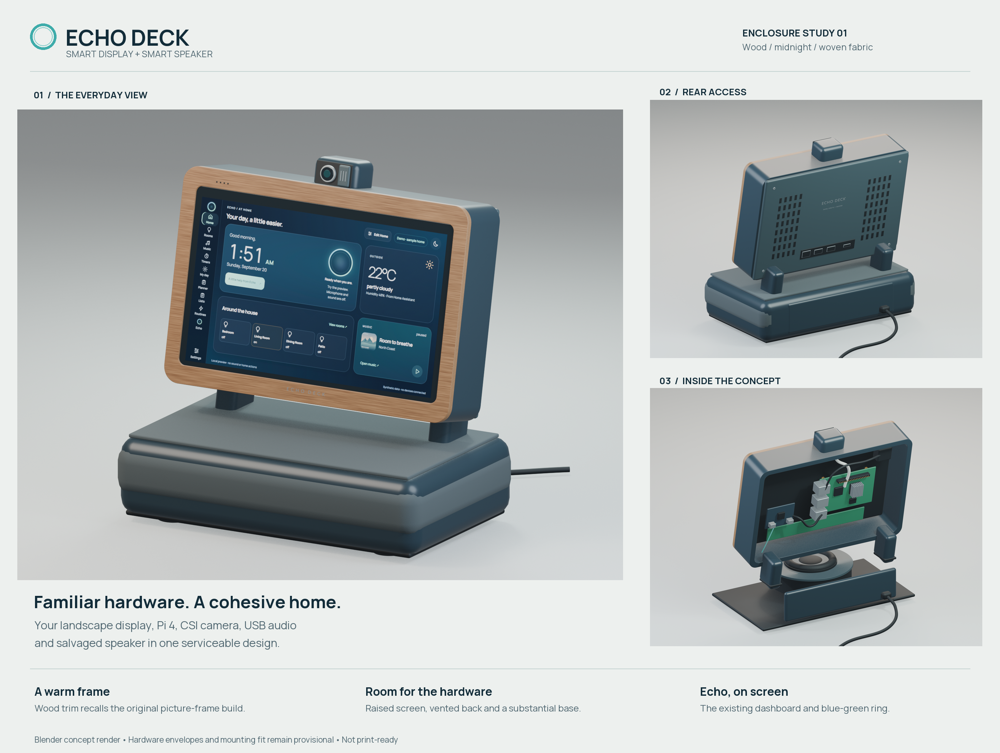

# Echo Deck enclosure concept

A wood-trimmed landscape display over a fabric-covered speaker base, with a
midnight-blue shell, camera pod and removable rear cover. The picture-frame
prototype informed the materials and proportions. The screen uses Echo's actual
dashboard with synthetic data.



**This is an editable design concept, not a print-ready enclosure.** Mounting
dimensions, cable routing, thermal behavior and acoustic performance remain
unverified. The [physical prototype photographs](../../docs/images/README.md)
show the existing build; these renders show a proposed enclosure.

## Explore the design

- [Front view](preview/echo-deck-front.png)
- [Rear view](preview/echo-deck-rear.png)
- [Cover-off packaging study](preview/echo-deck-service.png)
- [Editable Blender model](echo-deck-concept.blend), with packed screen texture
- [Blender geometry source](source/build_concept.py)
- [Presentation-sheet source](source/make_board.py)

The head tilts back above the retained circular speaker assembly. Upper-front
openings provide a separate microphone position. The top camera pod includes a
proposed mechanical shutter; it does not imply an installed electrical mute.
The rear cover and speaker grille are intended to be removable for servicing.
The speaker faces upward beneath the fabric top, with space below the display
for sound to leave the base. This acoustic arrangement still needs testing.

## Hardware basis

| Component | Representation |
| --- | --- |
| Raspberry Pi 4 Model B | Standard 85 × 56 mm PCB outline; simplified components and illustrative mounting locations |
| Landscape touchscreen | Existing 1024 × 600 aspect ratio; physical panel dimensions are provisional |
| Display connections | HDMI video and USB touch/power; no separate display power jack |
| Speaker | One salvaged Google Home Mini speaker assembly, with approximate outer envelope |
| Audio | Waveshare USB TO AUDIO interface and a separate USB miniature microphone |
| Camera | Arducam IMX519 autofocus CSI camera, represented by a protective pod |
| Power | External Pi supply; no battery assumed |

The illustrative active screen area is approximately 198 × 116 mm, the head
230 × 154 × 47 mm, and the base 244 × 148 × 63 mm including its fabric surfaces.
The speaker envelope is approximately 112 mm wide and the head tilts back
12 degrees. These are editable modeling assumptions, not measurements of the
installed panel or speaker. Electronics are simplified envelopes, not vendor
CAD or a wiring diagram. Rear vents and ports indicate intended access; they
are not verified through-holes or aligned connector cutouts.

Before creating printable parts, measure the panel, controller, mounting holes,
speaker lugs, camera case, USB boards, connectors and cable bend clearances.
Then validate stability, inserts, wall thickness, cooling, Wi-Fi clearance,
speaker isolation and microphone pickup. No STL files are supplied for this
concept, so it cannot be mistaken for the separately provided Crescent print kit.

## Rebuild

Use Blender 5 with Eevee. From the repository root:

```sh
blender --background --factory-startup --python enclosure/deck-concept-v1/source/build_concept.py
python -m pip install Pillow
python enclosure/deck-concept-v1/source/make_board.py
```

The first command overwrites the model and three view PNGs. The second Python
script strips render metadata and assembles the presentation sheet using the
repository's Manrope font. Copy the package before preserving a design variant.
The distributed model uses relative resource paths, contains the packed demo
screen, and includes no embedded scripts or external linked libraries. The
distributed images are re-encoded without EXIF, location or local file-path
metadata. The photographs remain separate from the rendered design.

The original design and source follow the repository's GPL-3.0-or-later license.
Manrope retains its [font license](../../web/fonts/Manrope-OFL.txt). Simplified
electronics are original reference geometry, not redistributed manufacturer CAD.
